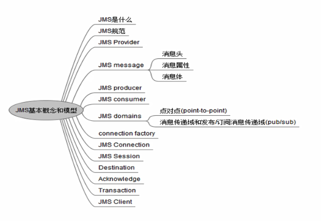
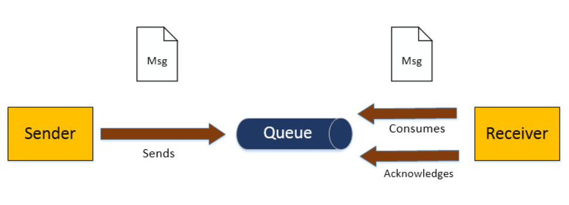
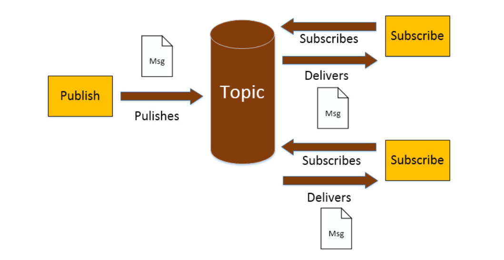
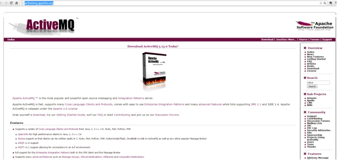
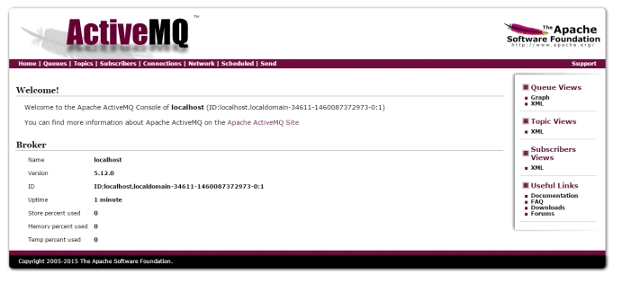
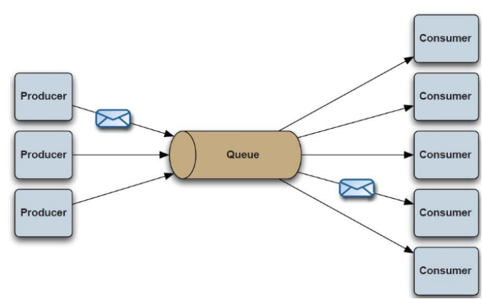
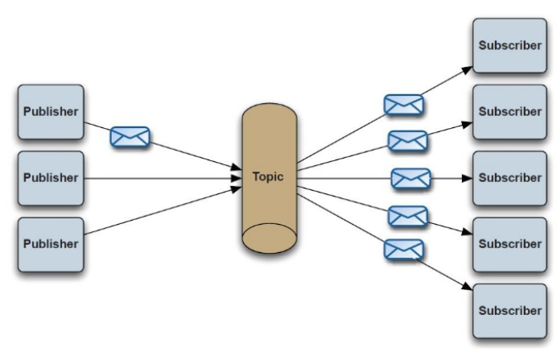
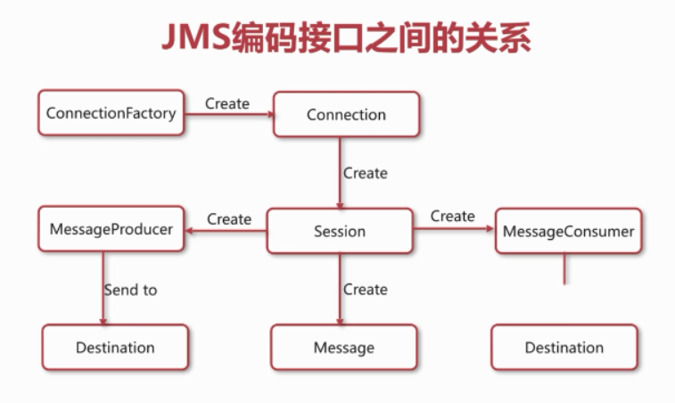
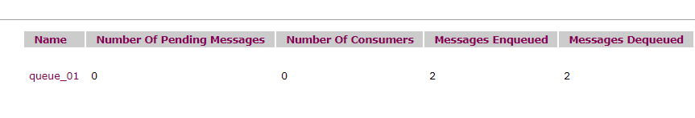
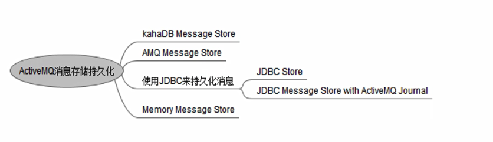

# JMS-JAVA消息服务规范

## 基本名词

### MOM

MOM（Message Oriented Middleware，面向消息的中间件）。发送者将消息发送给消息服务器，消息服务器将消息存放在若干队列中，在合适的时候再将消息发送给接收者。

这种模式下，发送和接收是异步的，发送者无需等待；

二者的生命周期未必相同：发送消息的时候接收者不一定运行，接收消息的时候发送者也不一定运行；

一对多通信：对于一个消息可以有多个接收者。

### JMS

JMS即Java消息服务（Java Message Service），是一个Java平台中关于面向消息中间件（MOM）的API，用于在两个应用程序之间，进行异步通信。

Java消息服务是一个与具体平台无关的API，绝大多数MOM提供商都对JMS提供支持。

JMS允许应用程序组件基于JavaEE平台创建、发送、接收和读取消息。

通信耦合度更低，消息服务更加可靠以及异步性。

### MQ

MQ是一个消息中间件, 全称为Message Queue, 生产者者往消息队列中写消息，消费可以读取队列中的消息。

### ActiveMQ

ActiveMQ 由Apache出品， 是一个支持JMS规范的 JMS Provider实现

JMS			==>	jdbc接口

ActiveMQ  ==>    mysql .jar


## JMS的基本概念和规范



### 消息传递域 (JMS domains) 

也叫消息模式, 消息模型, 有2种:

#### 1. 点对点(p2p)



概念

- 消息队列（Queue）
- 提供者(Sender)
- 消费者(Receiver)
- 每个消息都被发送到一个特定的队列，接收者从队列中获取消息。队列保留着消息，直到他们被消费或超时。

特点

- 每个消息只有一个消费者（Consumer）(即一旦被消费，消息就不再在消息队列中)
- 提供者和消费者之间在时间上没有依赖性，也就是说当提供者发送了消息之后，不管消费者有没有正在运行，它不会影响到消息被发送到队列
- 每条消息仅会传送给一个消费者。可能会有多个消费者在一个队列中侦听，但是每个队列中的消息只能被队列中的一个消费者所消费。
- 消息存在先后顺序。一个队列会按照消息服务器将消息放入队列中的顺序，把它们传送给消费者。当已被消费时，就会从队列头部将它们删除（除非使用了消息优先级）。
- 消费者在成功接收消息之后需向队列应答成功
  

#### 2. 发布订阅(pub/sub)



概念

- 主题（Topic）
- 发布者（Publisher）
- 订阅者（Subscriber）


特点

- 每个消息可以有多个消费者
- 发布者和订阅者之间有时间上的依赖性。针对某个主题的订阅者，它必须创建一个订阅者之后，才能消费发布者的消息，而且为了消费消息，订阅者必须保持运行的状态。
- 为了缓和这样严格的时间相关性，JMS允许订阅者创建一个可持久化的订阅。这样，即使订阅者没有运行，它也能接收到发布者的消息。
- 每条消息都会传送给称为订阅者的多个消息消费者。
- 发布者通常不会知道、也意识不到哪一个订阅者正在接收主题消息。
- 消息被推送给消费者，这意味着消息会传送给消费者，而无须请求。


### 消息组成(数据格式)

#### 1.消息头

包含消息的识别信息和路由信息

#### 2.消息体

- TextMessage		--一个字符串对象
- MapMessage		--一套名称-值对

- BytesMessage		--一个字节的数据流
- StreamMessage 	-- Java原始值的数据流
- ObjectMessage 	--一个序列化的 Java对象

#### 3.属性


# ActiveMQ的安装

进入http://activemq.apache.org/下载ActiveMQ

 


使用的版本是5.15.9

 

## 安装环境：

1、ActiveMQ是java语言开发的，需要 jdk

2、安装Linux系统。生产环境都是Linux系统


## 安装步骤

第一步：把ActiveMQ 的压缩包上传到Linux系统。

第二步：解压缩。

第三步：启动。

```
cd bin
```

启动：

```
./activemq start
```

关闭：

```
./activemq stop
```

查看状态：

```
./activemq status
```

 

进入管理后台：

http://192.168.5.11:8161/admin/

用户名：admin

密码：admin

 

 

# JMS-API

点对点：

 

发布/订阅：

 

 





## POM

```xml
<!--添加activemq的依赖-->
<dependency>
      <groupId>org.apache.activemq</groupId>
      <artifactId>activemq-all</artifactId>
      <version>5.15.9</version>
</dependency>
```


## 常量类

```java
public class MyConfig {
    //定义ActiveMQ的连接地址
    public static final String ACTIVEMQ_URL = "tcp://192.168.5.11:61616";
    //p2p 队列名称
    public static final String QUEUE_NAME = "queue_01";
    //topic 队列名称
    public static final String TOPIC_NAME = "topic_01";
}
```


## 1. p2p

### Producer

生产者：生产消息，发送端。

```java
public class Sender {
    public static void main(String[] args) throws JMSException {
        //创建连接工厂
        ConnectionFactory activeMQConnectionFactory =
                new ActiveMQConnectionFactory(MyConfig.ACTIVEMQ_URL);
        //创建连接
        Connection connection = activeMQConnectionFactory.createConnection();
        //打开连接
        connection.start();
        //创建会话
        Session session = connection.createSession(false, Session.AUTO_ACKNOWLEDGE);
        //创建队列目标
        //public interface Queue extends Destination
        Destination destination = session.createQueue(MyConfig.QUEUE_NAME);
        //创建一个生产者, 发送消息到 Destination
        MessageProducer producer = session.createProducer(destination);
        //创建一个文本消息
        TextMessage message = session.createTextMessage("你是帅哥吗?");
        //发送消息
        producer.send(message);
        //在本地打印消息
        System.out.println("生产者发送的消息是：" + message.getText());
        //关闭连接
        connection.close();
    }
}
```

 

### Consumer

消费者：接收消息。

```java
public class Recver {
    public static void main(String[] args) throws JMSException {
        //创建连接工厂
        ConnectionFactory activeMQConnectionFactory =
                new ActiveMQConnectionFactory(MyConfig.ACTIVEMQ_URL);
        //创建连接
        Connection connection = activeMQConnectionFactory.createConnection();
        //打开连接
        connection.start();
        //创建会话
        Session session = connection.createSession(false, Session.AUTO_ACKNOWLEDGE);
        //创建队列目标
        Destination destination = session.createQueue(MyConfig.QUEUE_NAME);
        //创建消费者
        javax.jms.MessageConsumer consumer = session.createConsumer(destination);
        //接收消息
        TextMessage receive = (TextMessage) consumer.receive();
        System.out.println("Recv 1 : " + receive.getText());
    }
}
```

 

测试 :  启动2个类, 谁先启动都可以, 观察控制台输出 和 后台管理页面



# JMS的可靠性机制

JMS消息被消费之后,  要收到确认,  才会认为是被成功消费。

消息的消费包含三个阶段： 客户端接收消息、客户端处理消息、消息确认

注意创建Session的 2个参数

```java
//创建会话
Session session = connection.createSession(false, Session.AUTO_ACKNOWLEDGE);
```

官方说明如下:

```java
		/*
         * Creates a <CODE>Session</CODE> object.
         *
         * @param transacted indicates whether the session is transacted
         * @param acknowledgeMode indicates whether the consumer or the client will
         *                acknowledge any messages it receives; ignored if the
         *                session is transacted. Legal values are
         *                <code>Session.AUTO_ACKNOWLEDGE</code>,
         *                <code>Session.CLIENT_ACKNOWLEDGE</code>, and
         *                <code>Session.DUPS_OK_ACKNOWLEDGE</code>.
         */
```

意思是:

```
第一个参数 = true , 表示事务性会话, 此时忽略第二个参数
第一个参数 = false, 表示非事务性会话, 此时第二个参数启作用, 表示收到消息后采用哪种确认方式
```

## 事务性会话

```java
//创建事务性会话, true, 第二个参数无效
Session session = connection.createSession(true, Session.AUTO_ACKNOWLEDGE);
//其他代码

//最后 类似jdbc的commit
session.commit();
```

## 非事务性会话

```java
//创建非事务性会话 false
Session session = connection.createSession(false, Session.AUTO_ACKNOWLEDGE);
```

在该模式下，消息何时被确认取决于创建会话时的应答模式,  有三种:

```
AUTO_ACKNOWLEDGE
对于同步消费, consumer.receive()方法调用返回, 且没有异常发生时, 将自动对收到的消息予以确认
对于异步消息, 当onMessage方法返回, 且没有异常发生时, 即对收到的消息自动确认

CLIENT_ACKNOWLEDGE
客户端自行决定通知时机
这种方式要求客户端使用javax.jms.Message.acknowledge() 方法完成确认

DUPS_OK_ACKNOWLEDGE
延时/批量通知
这种确认方式允许JMS不必急于确认收到的消息, 允许在收到多个消息之后一次完成确认, 与AUTO_ACKNOWLEDGE相比,这种确认方式在某些情况下可能更有效, 因为没有确认, 当系统崩溃或者网络出现故障的时候, 消息可以被重新传递
```

测试演示


## 2. Topic (pub/sub)

订阅可以分为非持久订阅和持久订阅

当所有的消息必须接收的时候，则需要用到持久订阅。反之，则用非持久订阅

Topic 默认是非持久订阅, 即消息不存储在MQ服务器中的，一旦发送之后，如果没有订阅，就没了。


### Producer 

```java
public class TopicSender {
    public static void main(String[] args) throws JMSException {
        //创建连接工厂
        ConnectionFactory activeMQConnectionFactory =
                new ActiveMQConnectionFactory(MyConfig.ACTIVEMQ_URL);
        //创建连接
        Connection connection = activeMQConnectionFactory.createConnection();
        //打开连接
        connection.start();
        //创建会话
        Session session = connection.createSession(false, Session.AUTO_ACKNOWLEDGE);
        //创建队列目标
        Destination destination = session.createTopic(MyConfig.TOPIC_NAME);
        //创建一个生产者
        MessageProducer producer = session.createProducer(destination);
        //创建消息
        TextMessage message = session.createTextMessage("我是帅哥");
        //发送消息
        producer.send(message);
        //在本地打印消息
        System.out.println("我现在发的消息是：" + message.getText());
        //关闭连接
        connection.close();
    }
}
```

 

### Consumer

建2个类, 代码一样, 类名不同

```java
public class TopicRecv01 {
    public static void main(String[] args) throws JMSException {
        //创建连接工厂
        ConnectionFactory activeMQConnectionFactory =
                new ActiveMQConnectionFactory(MyConfig.ACTIVEMQ_URL);
        //创建连接
        Connection connection = activeMQConnectionFactory.createConnection();
        //打开连接
        connection.start();
        //创建会话
        Session session = connection.createSession(false, Session.AUTO_ACKNOWLEDGE);
        //创建队列目标
        Destination destination = session.createTopic(MyConfig.TOPIC_NAME);
        //创建消费者
        javax.jms.MessageConsumer consumer = session.createConsumer(destination);
        //接收消息
        TextMessage receive = (TextMessage) consumer.receive();
        System.out.println("Recv 1 : " + receive.getText());
    }
}
```

测试: 

先启动2个消费者, 再启动生产者 (能收到消息)

先启动生产者, 再启动2个消费者 (收不到消息)

## 持久化订阅

生产者变化

```java
//创建一个生产者
MessageProducer producer = session.createProducer(destination);
//发送消息时用使用持久模式,默认值DeliveryMode.PERSISTENT
producer.setDeliveryMode(DeliveryMode.PERSISTENT);
```

消费者变化

```java
//创建连接
Connection connection = activeMQConnectionFactory.createConnection();
//持久订阅
connection.setClientID(myId);
//打开连接
connection.start();
//...
//创建队列目标
Topic topic = session.createTopic(MyConfig.TOPIC_NAME);
//创建消费者
MessageConsumer consumer = session.createDurableSubscriber(topic, myId);
```

生产者

```java
public class PersistentSender {
    public static void main(String[] args) throws JMSException {
        //创建连接工厂
        ConnectionFactory activeMQConnectionFactory =
                new ActiveMQConnectionFactory(MyConfig.ACTIVEMQ_URL);
        //创建连接
        Connection connection = activeMQConnectionFactory.createConnection();
        //打开连接
        connection.start();
        //创建会话
        Session session = connection.createSession(false, Session.AUTO_ACKNOWLEDGE);
        //创建队列目标
        Destination destination = session.createTopic(MyConfig.TOPIC_NAME);
        //创建一个生产者
        MessageProducer producer = session.createProducer(destination);
        //发送消息时用使用持久模式
        producer.setDeliveryMode(DeliveryMode.PERSISTENT);
        //创建消息
        TextMessage message = session.createTextMessage("我是永恒的帅哥");
        //发送消息
        producer.send(message);
        //在本地打印消息
        System.out.println("我现在发的消息是：" + message.getText());
        //关闭连接
        connection.close();
    }
}
```

消费者, 建2个类, 代码一样, 类名不同

```java
public class PersistentRecv01 {
    public static void main(String[] args) throws JMSException {
        String myId = "PersistentRecv01";
        //创建连接工厂
        ConnectionFactory activeMQConnectionFactory =
                new ActiveMQConnectionFactory(MyConfig.ACTIVEMQ_URL);
        //创建连接
        Connection connection = activeMQConnectionFactory.createConnection();
        //持久订阅
        connection.setClientID(myId);
        //打开连接
        connection.start();
        //创建会话
        Session session = connection.createSession(false, Session.AUTO_ACKNOWLEDGE);
        //创建队列目标
        Topic topic = session.createTopic(MyConfig.TOPIC_NAME);
        //创建消费者
        MessageConsumer consumer = session.createDurableSubscriber(topic, myId);
        //接收消息
        TextMessage receive = (TextMessage) consumer.receive();
        System.out.println("Persistent Recv 1 : " + receive.getText());
    }
}
```

注意: 要先启动消费者注册 

测试 

# 异步机制

以上示例代码都是用 consumer .receive() 方法接收数据, 但是此方法是 阻塞的

改用监听器的方式:

```java
		//注册监听器接收消息
        consumer.setMessageListener(new MessageListener() {
            @Override
            public void onMessage(Message message) {
                try {
                    TextMessage receive = (TextMessage) message;
                    System.out.println("Persistent Recv 1 : " + receive.getText());
                } catch (JMSException e) {
                    e.printStackTrace();
                }
            }
        });
```


# broker

Broker是ActiveMQ的一个实例。 在程序中创建一个Broker，然后运行，就可以传递消息。

```java
public class MyBrokerServer {
    public static void main(String[] args) {
        BrokerService brokerService = new BrokerService();
        try {
            brokerService.setUseJmx(true);
            brokerService.addConnector("tcp://localhost:61616");
            brokerService.start();
        } catch (Exception e) {
            e.printStackTrace();
        } 
    }
}
```

测试


# 持久化存储




## kahaDB 

默认的存储方式 (官方推荐)

配置文件 conf/activemq.xml , 就是spring的配置文件格式 

```xml
<!-- 大概80行 -->
<persistenceAdapter>
	<kahaDB directory="${activemq.data}/kahadb"/>
</persistenceAdapter>
```

 

## AMQ 

基于文件的存储方式

写入速度很快，容易恢复。

文件默认大小是 32 M

```xml
<persistenceAdapter>
	<amqPersistenceAdapter 
                       directory="${activemq.base}/activemq-data" maxFileLength="32mb"/>
</persistenceAdapter>
```


## JDBC 

基于数据库的存储

引入包 , mysql 和 HikariCP (依赖slf4j , 已经有了) , 放到 activemq/lib 下

conf/activemq.xml 配置 dataSource

```xml
	<!-- Hikari Datasource -->
    <bean id="activemq-mysql" class="com.zaxxer.hikari.HikariDataSource"  
        destroy-method="close">
        <property name="driverClassName" value="com.mysql.cj.jdbc.Driver" />
        <property name="jdbcUrl" 
            value="jdbc:mysql://192.168.5.55:3306/activemq?serverTimezone=GMT%2B8"/>
        <property name="username" value="root" />
        <property name="password" value="1234" />
    </bean>
```

conf/activemq.xml 配置持久化

```xml
        <persistenceAdapter>
            <!-- <kahaDB directory="${activemq.data}/kahadb"/> -->
	        <jdbcPersistenceAdapter dataSource="#activemq-mysql" 
                                    createTablesOnStartup="true"/>
        </persistenceAdapter>
```

重启activemq,  启动错误查看 data / activemq .log

成功, 建表如下: 

```
ACTIVEMQ_ ACKS ： 存储持久订阅的信息

ACTIVEMQ_ LOCK ： 锁表（集群使用）

ACTIVEMQ_ MSGS ： 消息表
```

在启动持久化订阅的测试, 查看表中数据


## JDBC Message store with activeMQ journal

引入了快速缓存机制, 性能会比jdbc store要好, 不支持集群


## Memory 

基于内存的存储


# 消息过期

默认情况下, 消息不会过期

有两种方法设置消息的过期时间, 时间单位为毫秒

```java
// 1
// 消息生产者  
MessageProducer producer =  session.createProducer(queue);  
// 消息是否为持久性的，如果不设置默认是持久化的。  
producer.setDeliveryMode(DeliveryMode.PERSISTENT);  
// 全部消息过期设置  
producer.setTimeToLive(10000);
```

```java
// 2
MessageProducer producer = session.createProducer(queue);
TextMessage message = session.createTextMessage("XXX");
// 单个消息的过期设置
// deliveryMode=是否持久化，priority=优先级，timeToLive=消息过期时间 
producer.send(message, DeliveryMode.PERSISTENT, 4, 10000);
```


# 消息的优先级

通常，可以确保将单个会话向目标发送的所有消息按其发送顺序传送至消费者。

如果为这些消息分配了不同的优先级，将首先尝试传送优先级较高的消息。 

有两种方法设置消息的优先级：

1. 使用 setPriority 方法，所有的消息都采用此优先级； 
2. 使用 send 方法为每一条消息设置优先级； 

消息优先级从 0-9 十个级别，0-4 是普通消息，5-9 是加急消息。如果不指定优先级，则默认为 4。

JMS 不要求严格按照这十个优先级发送消息，但必须保证加急消息要先于普通消息到达。

```java
// 全部
producer.setPriority(9);

// 单个
producer.send(message, DeliveryMode.PERSISTENT, 4, 1000);
```


# springboot 整合

## 6.1.发布者

```xml
<dependency>
            <groupId>org.springframework.boot</groupId>
            <artifactId>spring-boot-starter-activemq</artifactId>
</dependency>
```

```properties
spring.activemq.broker-url=tcp://192.168.5.55:61616
spring.activemq.user=admin
spring.activemq.password=admin
```

```java
@Resource
private JmsTemplate jmsTemplate;

@Override
public void saveProd(Product product, String desc) throws Exception {
    	productMapper.insert(product);
        // 发消息到MQ
        jmsTemplate.send(new ActiveMQTopic("topic.product.change"), (session) -> {
                // 消息就是主键值
                return session.createTextMessage(product.getId() + "");
            }
        );

}
```

```java
//入口类加注解
@EnableJms
```

## 6.2.订阅者

```xml
<dependency>
            <groupId>org.springframework.boot</groupId>
            <artifactId>spring-boot-starter-activemq</artifactId>
</dependency>
```

```properties
spring.activemq.broker-url=tcp://192.168.5.55:61616
spring.activemq.user=admin
spring.activemq.password=admin
```

```java
@JmsListener(destination = "topic.product.change", 
             containerFactory = "topicListenerContainerFactory")
public void importOne(String message) throws IOException, SolrServerException {
        logger.info("接收消息：" + message);
        Long id = Long.parseLong(message);
        // 根据ID查数据库
        SolrItem item = solrMapper.findById(id);
        // 索引
    	//
        SolrInputDocument doc = new SolrInputDocument();
        doc.setField("id", item.getId());
        doc.setField("name", item.getName());
        doc.setField("price", item.getPrice());
        doc.setField("pic", item.getPic());
        doc.setField("cname", item.getCname());
        doc.setField("desc", item.getDesc());
        solrClient.add(doc);
        solrClient.commit();
        logger.info("Solr索引成功");
}
```

```java
@SpringBootApplication
@EnableJms
public class AppSearchService {
    public static void main(String[] args) {
        SpringApplication.run(AppSearchService.class);
    }

    @Bean
    public JmsListenerContainerFactory<?> topicListenerContainerFactory(ConnectionFactory 				connectionFactory) {
        DefaultJmsListenerContainerFactory factory = 
            new DefaultJmsListenerContainerFactory();
        //开启topic模式
        factory.setPubSubDomain(true);
        factory.setConnectionFactory(connectionFactory);
        return factory;
    }
}
```

