# 什么是版本控制

版本控制（Revision control）是一种在开发的过程中用于管理我们对文件、目录或工程等内容的修改历史，方便查看更改历史记录，备份以便恢复以前的版本的软件工程技术。


# 常见的版本控制

主流的版本控制：

```
- Git
- SVN（Subversion）
- CVS（Concurrent Versions System）
- VSS（Micorosoft Visual SourceSafe）
- TFS（Team Foundation Server）
- Visual Studio Online
```

**现在使用最广泛的是Git与SVN**


# 什么是Git

Git是目前世界上最先进的分布式版本控制系统。

Git是免费、开源的

最初Git是为辅助 Linux 内核开发的，来替代 BitKeeper


# 安装Git

下载地址：https://git-scm.com/download

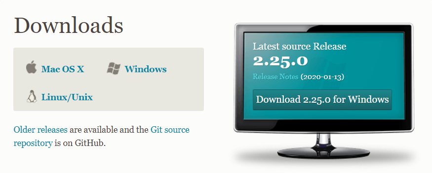


安装过程中都是用默认选项, 一路next就行, 默认安装目录可修改

开发中大多数情况都是windows，只介绍windows下的git的安装及使用。

安装完成后, 在开始菜单或者右键菜单

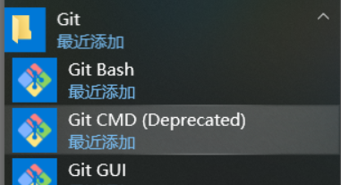


**Git Bash ：**Unix与Linux风格的命令行，推荐使用

打开 Git Bash

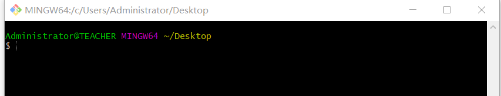

~ 就是home 

可以执行linux的常用命令 


# Git配置命令: git config

```
#查看现在的git环境详细配置
git config -l 

#查看系统config
git config --system --list
　　
#查看当前用户（global）配置
git config --global  --list
 
#查看当前仓库配置信息
git config --local  --list
```


# Git相关的配置文件有三个

```
--system 系统级
适用于系统所有用户和所有项目的值。Windows：E:\Program\Git\etc\gitconfig

--global 全局
适用于当前登录用户的配置。Windows：C:\Users\Administrator\.gitconfig

--local 当前项目
适用于特定git项目的配置。位于git项目目录中的 .git/config
```


# 设置用户名与邮箱

安装Git后首先要做的事情是设置你的用户名称和e-mail地址, 因为每次Git提交都会使用该信息。

```
#名称
git config --global user.name "xxxxxxx"

#邮箱
git config --global user.email "xxxxxxx@xxx.com"
```


# Git基本概念

## 工作区域

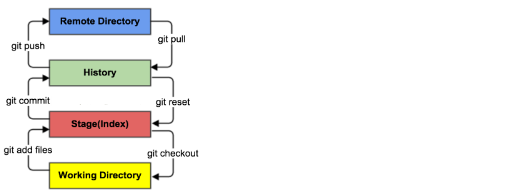

```
Workspace    工作区，存放项目代码的地方

Index/Stage  暂存区，用于临时存放你的改动，事实上它只是一个文件，保存即将提交到文件列表信息

Repository   仓库区（或本地仓库），就是安全存放数据的位置，这里面有你提交到所有版本的数据
			 其中HEAD指向最新放入仓库的版本
			 
Remote		 远程仓库，托管代码的服务器，可以简单的认为是你项目组中的一台电脑用于远程数据交换
```


## 工作流程

１、在工作目录中添加、修改文件；

２、将需要进行版本管理的文件放入暂存区域；

３、将暂存区域的文件提交到git仓库。

Git管理的文件有三种状态：已修改(modified), 已暂存 (staged), 已提交(committed)


# Git操作

## 创建工作目录与常用指令

工作目录（WorkSpace)

一般就是你希望Git帮助你管理的文件夹，可以是你项目的目录，也可以是一个空目录，建议不要有中文

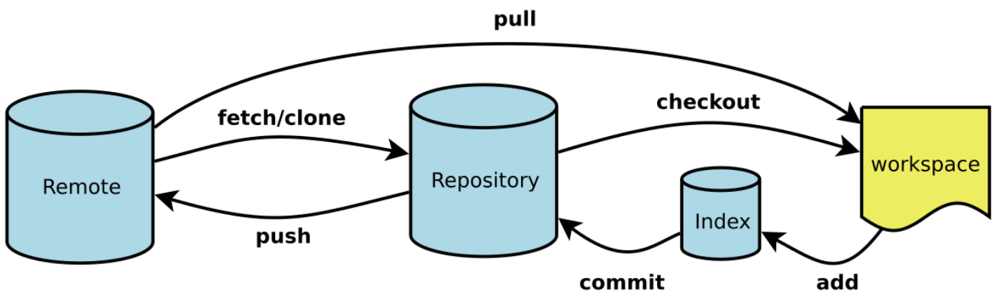

## 创建全新仓库

新建一个目录 D:/tmpdir

```
cd d:/tmpdir
或者
cd /d/tmpdir
```

```
git init
```

可看到输出
Initialized empty Git repository in D:/tmpdir/.git/

**这个 .git 可能是隐藏文件**

打开看看

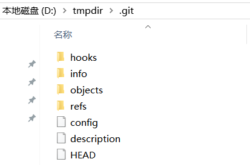


## GIT文件操作

​		版本控制就是对文件的版本控制，要对文件进行修改、提交等操作，首先要知道文件当前在什么状态，不然可能会提交了现在还不想提交的文件，或者要提交的文件没提交上。

​		GIT不关心文件两个版本之间的具体差别，而是关心文件的整体是否有改变，若文件被改变，在添加提交时就生成文件新版本的快照，而判断文件整体是否改变的方法就是用SHA-1算法计算文件的校验和。

### 文件4种状态

```
Untracked: 	未跟踪, 此文件在文件夹中, 但并没有加入到git库, 不参与版本控制. 
			通过git add 状态变为Staged.

Unmodify: 	文件已经入库, 未修改, 即版本库中的文件快照内容与文件夹中完全一致. 
			如果它被修改, 而变为Modified. 
			如果使用git rm移出版本库, 则成为Untracked文件.

Modified: 	文件已修改, 仅仅是修改, 并没有进行其他的操作. 
			如果通过git add可进入暂存staged状态
			如果使用git checkout 则丢弃修改过, 返回到unmodify状态
			这个git checkout即从库中取出文件, 覆盖当前修改

Staged: 	暂存状态. 
			执行git commit则将修改同步到库中,这时库中的文件和本地文件又变为一致,文件为Unmodify状态. 			   执行git reset HEAD filename取消暂存, 文件状态为Modified
```

### 状态 git status

```
#查看指定文件状态
git status [filename]

#查看所有文件状态
git status
```

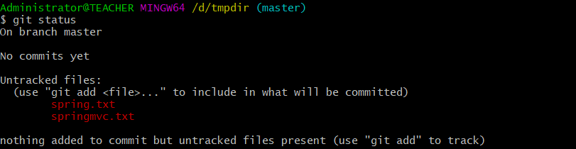


### 添加 git add

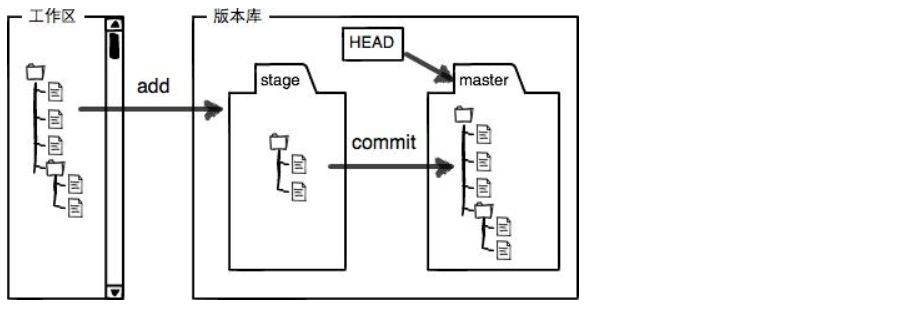

```
工作区（Working Directory）就是你在电脑里能看到的目录。

版本库（Repository）工作区有一个隐藏目录.git，这个不算工作区，而是Git的版本库。

Git的版本库里存了很多东西，其中最重要的就是称为stage（或者叫index）的暂存区，还有Git为我们自动创建的第一个分支master，以及指向master的一个指针叫HEAD。
```

```
# 添加指定文件到暂存区
git add [file1] [file2] ...

# 添加指定目录到暂存区，包括子目录
git add [dir]

# 添加当前目录的所有文件到暂存区
git add .
```

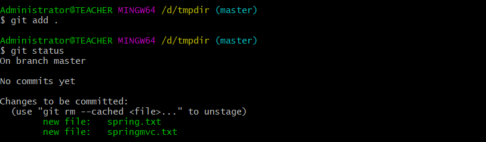


### 移除 git rm

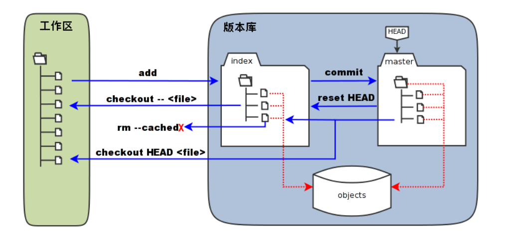

```
#从暂存区删除文件, 工作区则不做出改变
git rm --cached <file>

#只从stage中删除，保留物理文件
git rm --cached xxx.txt

#不但从stage中删除，同时删除物理文件
git rm -f xxx.txt

#把a.txt改名为b.txt
git mv a.txt b.txt
```

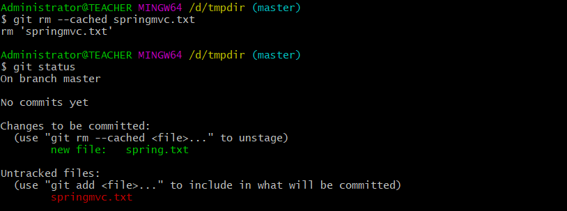

### 提交 git commit

```
# 提交暂存区到仓库区
git commit -m "message"

# 提交暂存区的指定文件到仓库区
git commit [file1] [file2] ... -m "message"

# 提交工作区自上次commit之后的变化，直接到仓库区，跳过了add,对新文件无效
git commit -a -m "message"

# 提交时显示所有diff信息
git commit -v

# 修订提交
# 使用一次新的commit，替代上一次提交
# 如果代码没有任何新变化，则用来改写上一次commit的提交信息
# --amend 追加提交,它可以在不增加一个新的commit-id的情况下将新修改的代码追加到前一次的commit-id中
git commit --amend -m 'message'

# 重做上一次commit，并包括指定文件的新变化
git commit --amend [file1] [file2] ...
```

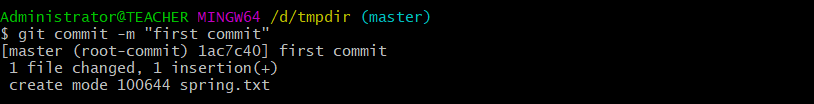


### 差异 git diff

将spring . txt 文件添加点内容

查看一下状态

```
git status
```

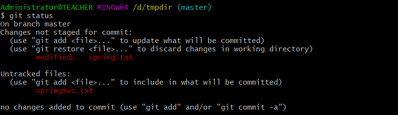

git status 只能查看对哪些文件做了改动，如果要看改动了什么，可以用：

```
#查看文件修改后的差异
git diff [files]

#暂存区的文件与之前已经提交过的文件
git diff --cached

#工作目录与上次提交时之间的所有差别
git diff HEAD
```

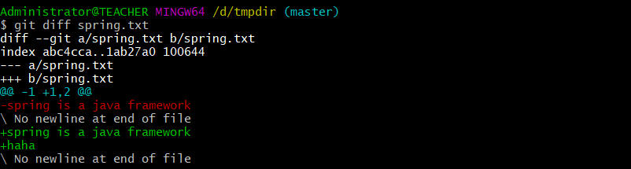

--- a表示修改之前的文件，+++ b表示修改后的文件

### 签出 git checkout

git checkout 是 git 常用的命令之一，同时也是一个很危险的命令，因为这条命令会重写工作区

```
#汇总显示工作区、暂存区与HEAD的差异
git checkout

#同上
git checkout HEAD

#用暂存区中filename文件来覆盖工作区中的filename文件
#相当于取消自上次执行git add filename以来（如果执行过）的本地修改
git checkout -- filename

#检出branch分支。更新HEAD以指向branch分支，以及用branch指向的树更新暂存区和工作区
git checkout branch

#用branch所指向的提交中filename替换暂存区和工作区中相应的文件
#注意会将暂存区和工作区中的filename文件直接覆盖。
git checkout branch -- filename

#注意git checkout 命令后的参数为一个点（“.”）
#这条命令危险！会取消所有本地的修改（相对于暂存区）
#相当于用暂存区的所有文件直接覆盖本地文件，不给用户任何确认的机会！
git checkout . 
或
git checkout -- .

#如果不加commit_id, 表示恢复文件到本地版本库中最新的状态
git checkout commit_id -- filename
```

### 忽略 .gitignore

有些时候我们不想把某些文件纳入版本控制中

在主目录下建立".gitignore"文件，此文件有如下规则：

```
1. 忽略文件中的空行或以井号（#）开始的行将会被忽略。
2. 可以使用Linux通配符。
	例如：星号（*）代表任意多个字符
	问号（？）代表一个字符
	方括号（[abc]）代表可选字符范围
	大括号（{string1,string2,...}）代表可选的字符串等
3. 如果名称的最前面有一个感叹号（!），表示例外规则，将不被忽略
4. 如果名称的最前面是一个路径分隔符（/），表示要忽略的文件在此目录下，而子目录中的文件不忽略
5. 如果名称的最后面是一个路径分隔符（/），表示要忽略的是目录
```

例如

```
#为注释
*.txt 		#忽略所有 .txt结尾的文件
!lib.txt 	#但lib.txt除外
/temp 		#仅忽略项目根目录下的temp,不包括其它目录temp
build/ 		#忽略build/目录下的所有文件
log/*.txt 	#会忽略 log/a.txt 但不包括 log/server/a.txt
```

##### java开发通用模版

```
#java
*.class

#package file
*.war
*.ear
*.zip
*.tar.gz
*.rar

#maven ignore
target/
build/

#eclipse ignore
.settings/
.project
.classpatch

#Intellij idea
.idea/
/idea/
*.ipr
*.iml
*.iws

# temp file
*.log
*.cache
*.diff
*.patch
*.tmp

# system ignore
.DS_Store
Thumbs.db
```

### 日志 git log

```
git log

# 图形化的方显示
git log --graph

# 显示1行
git log -1

# 查看所有分支日志
git reflog
```

### 历史 history

记录你输入过的命令

```
history
```

### 列表 git ls-files

```
#查看指定状态的文件
git ls-files [-z] [-t] [-v] 
(--[cached|deleted|others|ignored|stage|unmerged|killed|modified])* (-[c|d|o|i|s|u|k|m])*
```

### 撤销

#### 撤销暂存区 git restore

```
git restore --staged <file>...
```

#### 撤销本地仓库 git reset

撤销提交有两种方式：**使用HEAD指针** 和 **使用commit id**

在Git中，有一个HEAD指针指向当前分支中最新的提交。

当前版本，我们使用"HEAD^"

再前一个版本可以使用"HEAD^^"

如果想回退到更早的提交，可以使用"HEAD~n" 	(HEAD^=HEAD~1，HEAD^^=HEAD~2)

**第一次提交不可撤销**

```
# 直接删除掉目标HEAD之后所有的操作，且工作去和暂存区都会修改
git reset --hard ***
# 将工作区的文件回退到目标版本，但是不会改变暂存区的状态
git reset --soft ***

# HEAD
git reset --hard "HEAD^"
git reset --hard "HEAD~1"

# 使用commit id
git reset --bfe88115af20e0b8cf16123dc4d53423ee5f3910
```

### 文件操作小结

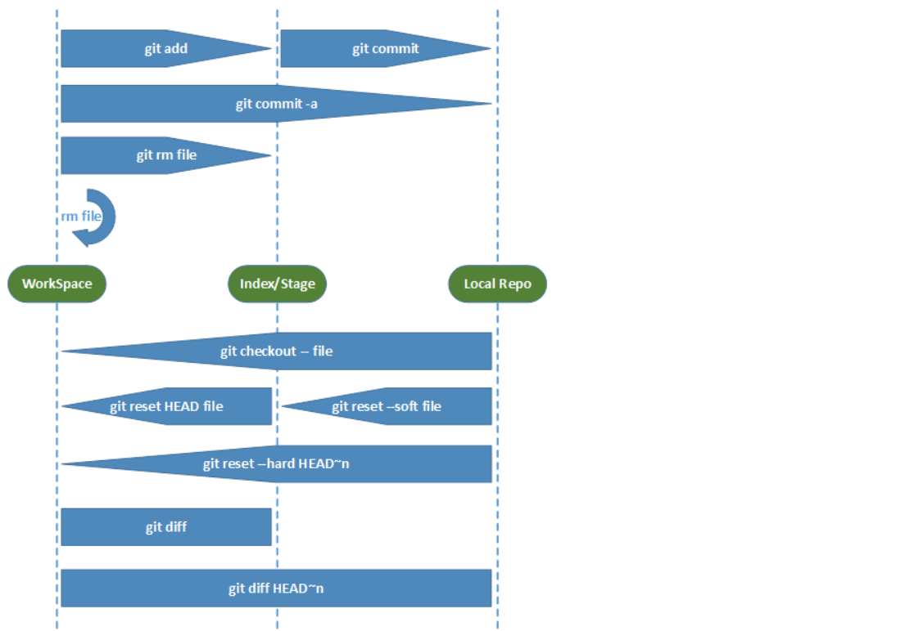


# GIT分支

截止到目前，只有一条时间线，在Git里，这个分支叫主分支，即master分支。

HEAD严格来说不是指向提交，而是指向master，master才是指向提交的，所以，HEAD指向的就是当前分支

可以创建一个属于自己的分支，别人看不到，还继续在原来的分支上正常工作，而你在自己的分支上干活，想提交就提交，直到开发完毕后，再一次性合并到原来的分支上，这样，既安全，又不影响别人工作。

## 分支命令

```
# 列出所有本地分支
$ git branch

# 列出所有远程分支
$ git branch -r

# 列出所有本地分支和远程分支
$ git branch -a

# 新建一个分支，但依然停留在当前分支
$ git branch [branch-name]

# 新建一个分支，并切换到该分支
$ git checkout -b [branch]

# 新建一个分支，指向指定commit
$ git branch [branch] [commit]

# 新建一个分支，与指定的远程分支建立追踪关系
$ git branch --track [branch] [remote-branch]

# 切换到指定分支，并更新工作区
$ git checkout [branch-name]

# 切换到上一个分支
$ git checkout -

# 建立追踪关系，在现有分支与指定的远程分支之间
$ git branch --set-upstream [branch] [remote-branch]

# 合并指定分支到当前分支
$ git merge [branch]

# 选择一个commit，合并进当前分支
$ git cherry-pick [commit]

# 删除分支
$ git branch -d [branch-name]

# 删除远程分支
$ git push origin --delete [branch-name]
$ git branch -dr [remote/branch]
```

例:

```
# 新建一个分支，但依然停留在当前分支master
$ git branch dev

# 查看所有本地分支
$ git branch

# 在当前分支master上 修改spring.txt内容 然后提交
$ git commit -a -m 'master777'

# 切换到dev分支
$ git checkout dev

# 查看spring.txt的内容, 没有master最新的提交内容
$ cat spring.txt

# 再次修改spring.txt内容 然后提交
$ git commit -a -m dev777

# 切换到master分支
$ git checkout master

# 合并dev分支到当前分支(不一定是master)
$ git merge dev
```

出现如下提示:

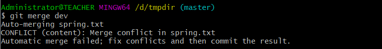

```
# 此时查看状态
$ git status
```

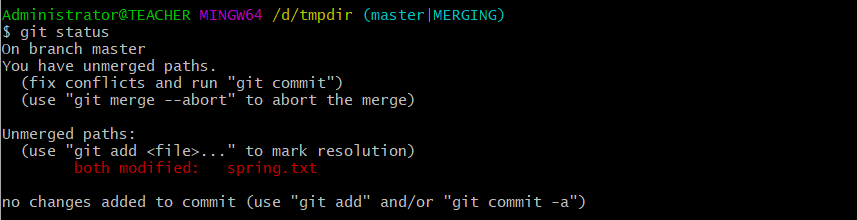

```
# 此时查看内容
$ cat spring.txt
```

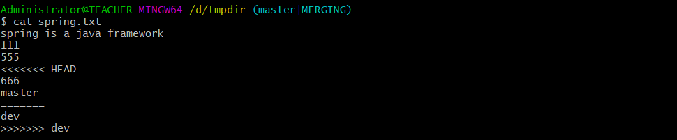

Git用<<<<<<<，=======，>>>>>>>标记出不同分支的内容

<<<<<<<HEAD	是指主分支修改的内容，>>>>>>>dev 	是指dev上修改的内容

解决的办法是我们可以修改冲突文件后重新提交，请注意当前的状态 (master|MERGING)

VSCode可直接显示如下:

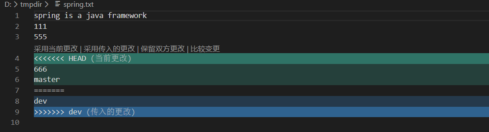

这里点击 **保留双方更改**

手动解决完冲突后就可以把此文件添加到暂存区，用git commit命令来提交，就像平时修改了一个文件一样。

```
$ git add spring.txt

$ git commit -m "spring.txt合并冲突"

$ git log --graph
```

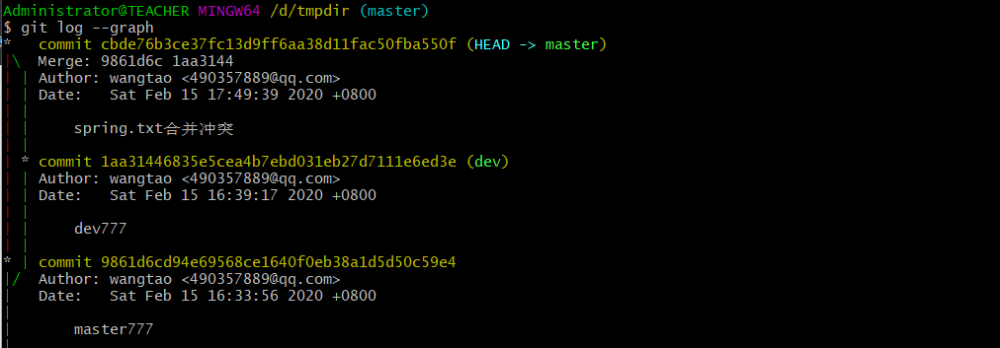

**红线部分 分支合并**

## 分支策略

master主分支应该非常稳定，用来发布新版本，一般情况下不允许在上面工作，工作一般情况下在新建的dev分支上工作，工作完后，比如要发布，或者dev分支代码稳定后, 可以合并到主分支master上来。


# 远程仓库

## 托管平台

```
#GitHub 
https://github.com/

#Gitlab
https://about.gitlab.com/

#码云
https://gitee.com/

#coding.net
https://coding.net/
```


## 申请帐号与设置

可以申请 码云 或 coding 或 GitHub 的免费账号

建议申请国内的 码云或coding , 国外的GitHub太慢

以coding为例, 申请好以后, 登录创建一个仓库, 会有一个地址

https://e.coding.net/private_team/first.git


## 上传到远程仓库 git push

```
# 添加远程主机，主机名为origin 地址为https://e.coding.net/private_team/first.git
$ git remote add origin https://e.coding.net/private_team/first.git

# 本地的master分支推送到origin主机，同时指定origin为默认主机
# 后面就可以不加任何参数使用git push了，-u 参数指定一个默认主机
$ git push -u origin master
```

报错:

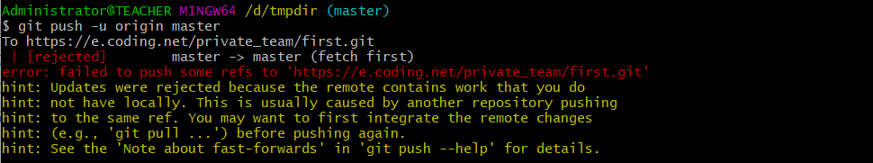

原因: 在 coding 建仓库时 带了 README 文件 , 要求先 git pull 下来

```
$ git pull origin master
```

报错:

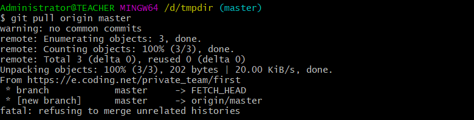

原因: 拒绝合并 不相关的历史

```
$ git pull origin master --allow-unrelated-histories
```

pull 成功

继续

```
$ git push -u origin master:master
```

push 成功

## 克隆远程仓库 git clone

```
$ git clone <版本库的网址> <本地目录名>
```

```
$ git clone https://e.coding.net/private_team/first.git d:/ttt
```

## 常用操作指令

```
# 下载远程仓库的所有变动
$ git fetch [remote]

# 显示所有远程仓库
$ git remote -v

# 显示某个远程仓库的信息
$ git remote show [remote]

# 增加一个新的远程仓库，并命名
$ git remote add [shortname] [url]

# 取回远程仓库的变化，并与本地分支合并
$ git pull [remote] [branch]

# 上传本地指定分支到远程仓库
$ git push [remote] [branch]

# 强行推送当前分支到远程仓库，即使有冲突
$ git push [remote] --force

# 推送所有分支到远程仓库
$ git push [remote] --all

# 简单查看远程所有仓库
$ git remote  （只能查看远程仓库的名字）

# 查看单个仓库
$ git remote show [remote-branch-name]

# 新建远程仓库
# git remote add [branchname] [url]

# 修改远程仓库
$ git remote rename [oldname] [newname]

# 删除远程仓库
# git remote rm [remote-name]

# 获取仓库所有更新，但不自动合并当前分支
$ git fetch [remote-name] 

# 获取仓库所有更新，并自动合并到当前分支
$ git pull 

# 上传
$ git push [remote-name] [branch]
```

```
git pull 远程地址 <远程分支>:<本地分支>

git push是<本地分支>:<远程分支>
```


# 安装 TortoiseGit

下载地址：https://tortoisegit.org/download/


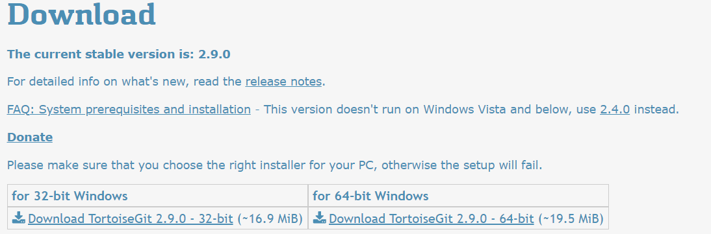


# 安装 TortoiseGit中文语言包(可选)