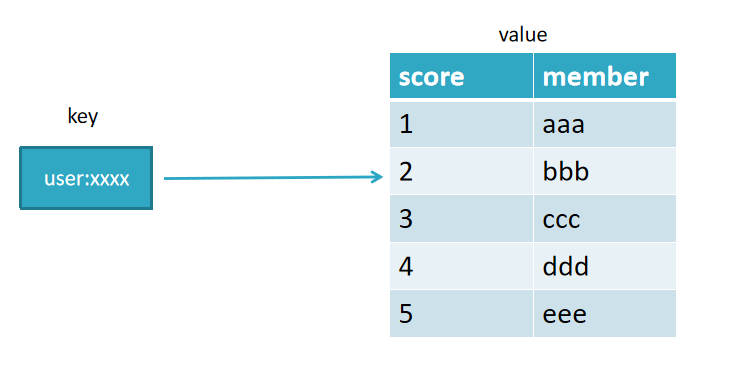

Redis是一个开源的使用ANSI C语言编写、支持网络、可基于内存亦可持久化的日志型、Key-Value数据库，并提供多种语言的API


# Redis基本通讯模型

执行过程：发送指令－〉执行命令－〉返回结果
执行命令：单线程执行，所有命令进入队列，按顺序执行
单线程快原因：纯内存访问， 单线程避免线程切换和竞争产生资源消耗，RESP协议简单


# 字符串(String)

字符串类型：实际上可以是字符串（包括XML JSON），
还有数字（整形 浮点数），二进制（图片 音频 视频），最大不能超过512MB

```
//设值命令：
set age 23 ex 10  	//10秒后过期  px 10000 毫秒过期

setnx name test  	//不存在键name时，返回1设置成功；存在的话失败0

//只在键已经存在时，才对键进行设置操作。
set age 25 xx

//只在键不存在时，才对键进行设置操作。 SET key value NX 效果等同于 SETNX key value
set age 25 nx

//获值命令：
get age //存在则返回value, 不存在返回nil

//批量设值：
mset country china city beijing
//批量获取
mget country city address //返回china  beigjin, address为nil
```

```
incr age 				//必须为整数自加1，非整数返回错误，无age键从0自增返回1
decr age 				//整数age减1
incrby age 2 			//整数age+2
decrby age 2			//整数age -2
incrbyfloat score 1.1 	//浮点型score+1.1
```

```
//append追加指令：
set name hello 
append name world 	//追加后成helloworld

//字符串长度：
set hello “世界”
strlen hello		//结果6，每个中文占3个字节

//截取字符串：
set name helloworld
getrange name 2 4	//返回 llo
```


# 哈希(Hash)

```
命令  
hset key field value
设值
hset user:1 name abc    		//成功返回1，失败返回0
取值
hget user:1 name              	//返回name
删值
hdel user:1 age               	//返回删除的个数
计算个数
hset user:1 name abc; 
hset user:1 age 23; 
hlen user:1               		//返回2，user:1有两个属性值
批量设值
hmset user:2 name abc age 23 sex boy //返回OK
批量取值
hmget user:2 name age sex  
判断field是否存在
hexists user:2 name 			//若存在返回1，不存在返回0
获取所有field
hkeys user:2            		// 返回name age sex三个field
获取user:2所有value
hvals user:2     				// 返回abc 23 boy
获取user:2所有field与value
hgetall user:2 					//
增加1
hincrby user:2 age 1      		//age+1
hincrbyfloat user:2 age 2   	//浮点型加2
```


```
三种方案实现用户信息存储优缺点

1.原生   
	set user:1:name abc;
	set user:1:age  23;
	set user:1:sex boy;
优点：简单直观，每个键对应一个值
缺点：键数过多，占用内存多，用户信息过于分散，不用于生产环境

2.将对象序列化存入redis
	set user:1 serialize(userInfo);
优点：编程简单，若使用序列化合理内存使用率高
缺点：序列化与反序列化有一定开销，更新属性时需要把userInfo全取出来进行反序列化，更新后再序列化到redis

3，使用hash类型：
	hmset user:1 name name age 23 sex boy
优点：简单直观，使用合理可减少内存空间消耗
缺点：要控制ziplist与hashtable两种编码转换，且hashtable会消耗更多内存erialize(userInfo);
```


# 列表(List)

```
添加命令：
rpush name c b a 	//从右向左插入cba, 返回值3
lrange name 0 -1 	//从左到右获取列表所有元素 返回 c b a
lpush key c b a 	//从左向右插入cba
linsert key2 before key1 value2 	//在b之前插入teacher, after为之后
lrange name 0 -1 				//查看：c teacher b a


查找命令：
lrange key start end 	//索引下标特点：从左到右为0到N-1
lindex name -1 			//返回最右末尾a，-2返回b
llen name        		//返回当前列表长度
lpop name       		//把最左边的第一个元素c删除
rpop name      			//把最右边的元素a删除
```


```
订单例子

1 每个用户有多个订单key为 order:1   order:2  order:3, 结合hmset
	hmset order:1 orderId 1 money 36.6 time 2018-01-01 
	hmset order:2 orderId 2 money 38.6 time 2018-01-01 
	hmset order:3 orderId 3 money 39.6 time 2018-01-01 

2 把订单信息的key放到队列
	lpush user:1:order order:1 order:2 order:3

3 新产生了一个订单order:4，
	hmset order:4 orderId 4 money 40.6 time 2018-01-01 

4 追加一个order:4放入队列第一个位置
	lpush user:1:order order:4

5 当需要查询用户订单记录时：
	List orderKeys = lrange user:1:order 0 -1 //查询user:1 的所有订单key值
	for(Order order: orderKeys){
		hmget order:1
	}
```


# 集合(Set)

```
exists user    	//检查user键值是否存在
sadd user a b c	//向user插入3个元素，返回3
sadd user a b  	//若再加入相同的元素，则重复无效，返回0
smembers user 	//获取user的所有元素,返回结果无序

srem user a   	//返回1，删除a元素

scard user    	//返回2，计算元素个数
```


# 有序集合(ZSET)

常用于排行榜, 如视频网站需要对用户上传视频做排行榜, 或点赞数, 不能有重复的元素



```
指令
zadd key score member [score member......]

//name的点赞数1, 返回操作成功的条数1
zadd user:zan 200 name
// 返回3
zadd user:zan 200 name1 120 name2 100 name3

zadd test:1 nx 100 name   			//键test:1必须不存在，主用于添加
zadd test:1 xx incr 200 name   		//键test:1必须存在，主用于修改,此时为300
zadd test:1 xx ch incr -299 name 	//返回操作结果1，300-299=1

zrange test:1 0 -1 withscores  		//查看点赞（分数）与成员名

zcard test:1     					//计算成员个数， 返回1
```

```
排名场景
zadd user:zan 200 name1 120 name2 100 name3	//先插入数据
zrange user:3 0 -1 withscores 				//查看分数与成员

zrank user:3 name		//返回名次：第3名返回2，从0开始到2，共3名
zrevrank user:3 name 	//返回0， 反排序，点赞数越高，排名越前
```

```
排行榜系统，如视频网站需要对用户上传的视频做排行榜
点赞数：
排行榜：user:1:20190106  // 人员：zhang3 //获赞数：3
zadd user:1:20190106 3 zhang3  //获得3个赞
再获一赞：
zincrby user:1:20190106 1 zhang3  //在3的基础上加1
将用户从排行榜删掉：
zrem user:1:20190106 zhang3
展示赞数最多的5个用户：
zrevrangebyrank user:1:20190106  0  4 
查看用户赞数与排名：
zscore user:1:20190106 zhang3   
zrank user:1:20190106 zhang3
```


# Redis全局命令

```
查看所有键：
keys *
键总数 ：
dbsize       //如果存在大量键，线上禁止使用此指令
检查键是否存在：
exists key  //存在返回1，不存在返回0
删除键：
del key
键过期：
expire key seconds  	//expire name 10,表示10秒过期
ttl key             	// 查看剩余的过期时间
键的数据结构类型：
type key 				//返回string,键不存在返回none
```


# redis数据库管理

```
redis默认有0-15号库

select 0  选择0号库

flushdb  清空当前数据库

flushall  清空所有数据库

dbsize 键总数 
```