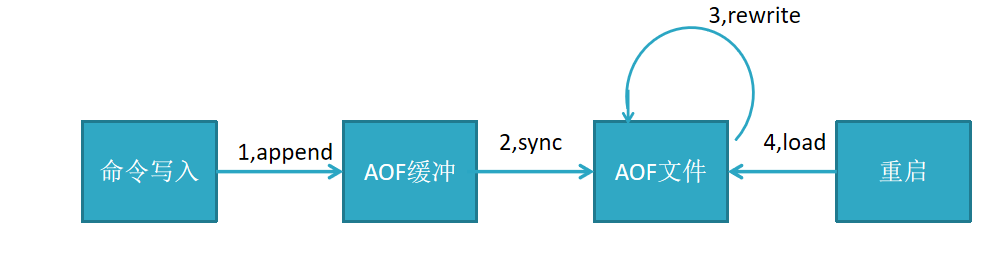

redis是一个支持持久化的内存数据库,也就是说redis需要经常将内存中的数据同步到磁盘来保证持久化，持久化可以避免因进程退出而造成数据丢失；

## **RDB机制**

RDB持久化把当前进程数据生成快照（.rdb）文件保存到硬盘的过程，有手动触发和自动触发

**1、save触发方式**

save命令：阻塞当前Redis，直到RDB持久化过程完成为止执行完成时候如果存在老的RDB文件，就把新的替代掉旧的。我们的客户端可能都是几万或者是几十万，这种方式显然不可取。，若内存实例比较大会造成长时间阻塞，线上环境不建议用它


**2、bgsave触发方式**

bgsave命令：redis进程执行fork操作创建子线程，由子线程完成持久化，阻塞只发生在fork阶段，阻塞时间很短（微秒级），是save的优化,在执行redis-cli shutdown关闭redis服务时，如果没有开启AOF持久化，自动执行bgsave;


```
命令：config set dir /usr/local  	//设置rdb文件保存路径

备份：bgsave  						//将dump.rdb保存到usr/local下

恢复：将dump.rdb放到redis安装目录与redis.conf同级目录，重启redis即可

优点：	（1）RDB文件紧凑，全量备份，非常适合用于进行备份和灾难恢复。

（2）生成RDB文件的时候，redis主进程会fork()一个子进程来处理所有保存工作，主进程不需要进行任何磁盘IO操作。

（3）RDB 在恢复大数据集时的速度比 AOF 的恢复速度要快。
缺点： 无法做到实时持久化，每次都要创建子进程，频繁操作成本过高。RDB快照是一次全量备份，存储的是内存数据的二进制序列化形式，存储上非常紧凑。当进行快照持久化时，会开启一个子进程专门负责快照持久化，子进程会拥有父进程的内存数据，父进程修改内存子进程不会反应出来，所以在快照持久化期间修改的数据不会被保存，可能丢失数据


```

**3、自动触发**

自动触发是由我们的配置文件来完成的。在redis.conf配置文件中，里面有如下配置，我们可以去设置：

**①save：**这里是用来配置触发 Redis的 RDB 持久化条件，也就是什么时候将内存中的数据保存到硬盘。比如“save m n”。表示m秒内数据集存在n次修改时，自动触发bgsave。

默认如下配置：

\#表示900 秒内如果至少有 1 个 key 的值变化，则保存save 900 1#表示300 秒内如果至少有 10 个 key 的值变化，则保存save 300 10#表示60 秒内如果至少有 10000 个 key 的值变化，则保存save 60 10000

不需要持久化，那么你可以注释掉所有的 save 行来停用保存功能。

**②stop-writes-on-bgsave-error ：**默认值为yes。当启用了RDB且最后一次后台保存数据失败，Redis是否停止接收数据。这会让用户意识到数据没有正确持久化到磁盘上，否则没有人会注意到灾难（disaster）发生了。如果Redis重启了，那么又可以重新开始接收数据了

**③rdbcompression ；**默认值是yes。对于存储到磁盘中的快照，可以设置是否进行压缩存储。

**④rdbchecksum ：**默认值是yes。在存储快照后，我们还可以让redis使用CRC64算法来进行数据校验，但是这样做会增加大约10%的性能消耗，如果希望获取到最大的性能提升，可以关闭此功能。

**⑤dbfilename ：**设置快照的文件名，默认是 dump.rdb

**⑥dir：**设置快照文件的存放路径，这个配置项一定是个目录，而不能是文件名。

我们可以修改这些配置来实现我们想要的效果。因为第三种方式是配置的，所以我们对前两种进行一个对比：


## AOF机制


针对RDB不适合实时持久化，redis提供了AOF持久化方式来解决

```
开启设置：appendonly yes  (默认不开启，为no)

默认文件名：appendfilename "appendonly.aof"  
```

 **1、流程​**       

```
所有的写入命令(set hset)会append追加到aof_buf缓冲区中

AOF缓冲区向硬盘做sync同步

随着AOF文件越来越大，需定期对AOF文件rewrite重写，达到压缩

当redis服务重启，可load加载AOF文件进行恢复
```




**2、文件重写原理**

AOF的方式也同时带来了另一个问题。持久化文件会变的越来越大。为了压缩aof的持久化文件。redis提供了bgrewriteaof命令。将内存中的数据以命令的方式保存到临时文件中，同时会fork出一条新进程来将文件重写。


重写aof文件的操作，并没有读取旧的aof文件，而是将整个内存中的数据库内容用命令的方式重写了一个新的aof文件，这点和快照有点类似。


AOF配置

```
appendonly yes           //启用aof持久化方式

appendfsync always 		//每收到写命令就立即强制写入磁盘，最慢的，但是保证完全的持久化，不推荐使用

appendfsync everysec 	//每秒强制写入磁盘一次，性能和持久化方面做了折中，推荐

appendfsync no         	//完全依赖os，性能最好,持久化没保证（操作系统自身的同步）

no-appendfsync-on-rewrite  yes  	//正在导出rdb快照的过程中,要不要停止同步aof
auto-aof-rewrite-percentage 100  	//aof文件大小比起上次重写时的大小,增长率100%时,重写
auto-aof-rewrite-min-size 64mb   	//aof文件,至少超过64M时,重写
```

AOF恢复

```
设置appendonly yes；

将appendonly.aof放到dir参数指定的目录

启动redis会自动加载appendonly.aof文件
```

redis重启时加载AOF与RDB的顺序

```
当AOF和RDB文件同时存在时，优先加载AOF
若关闭了AOF，加载RDB文件
加载AOF/RDB成功，redis重启成功
AOF/RDB存在错误，启动失败打印错误信息
```


## **RDB和AOF到底该如何选择**

选择的话，两者加一起才更好。因为两个持久化机制你明白了，剩下的就是看自己的需求了，需求不同选择的也不一定，但是通常都是结合使用

