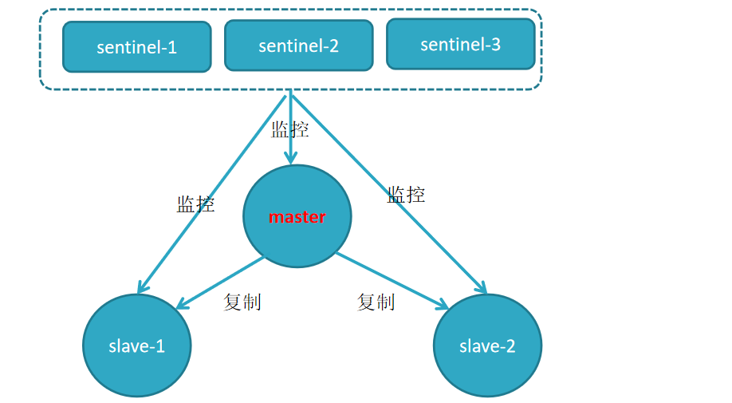

## 哨兵模式

redis主从模式解决了数据备份和单例可能存在的性能问题，但是其也引入了新的问题。

由于主从模式配置了三个redis实例，并且每个实例都使用不同的ip（如果在不同的机器上）和端口号，主从模式下可以将读写操作分配给不同的实例进行从而达到提高系统吞吐量的目的

新的问题:

1. 每个客户端连接redis实例的时候都是指定了ip和端口号的，如果所连接的redis实例因为故障下线了，而主从模式也没有提供一定的手段通知客户端另外可连接的客户端地址，因而需要手动更改客户端配置重新连接。

2. 主从模式下，如果主节点由于故障下线了，那么从节点因为没有主节点而同步中断，因而需要人工进行故障转移工作。

为了解决这两个问题，在2.8版本之后redis正式提供了sentinel（哨兵）架构。

几个概念：

| 名词             | 逻辑结构                   | 物理结构                   |
| ---------------- | -------------------------- | -------------------------- |
| 主节点           | redis主服务/数据库         | 一个独立的redis进程        |
| 从节点           | redis从服务/数据库         | 一个独立的redis进程        |
| sentinel节点     | 监控redis数据节点          | 一个独立的sentinel进程     |
| sentinel节点集合 | 若干sentinel节点的抽象集合 | 若干sentinel节点进程       |
| 应用方           | 泛指一个或多个客户端       | 一个或多个客户端线程或进程 |


每个sentinel节点其实就是一个redis实例，与主从节点不同的是sentinel节点作用是用于监控redis数据节点的

sentinel节点集合则表示监控一组主从redis实例多个sentinel监控节点的集合





## 节点感知

哨兵有三个定时监控任务完成对各节点的发现和监控


## 故障迁移

#### 主观下线

哨兵节点会每秒一次的频率向建立了命令连接的实例发送PING命令，如果在`down-after-milliseconds`毫秒内没有做出有效响应，哨兵就会将该实例在本结构体中的状态标记为`SRI_S_DOWN`主观下线

#### 客观下线

当一个哨兵节点发现主节点处于主观下线状态时，会向其他的哨兵节点发出询问，该节点是不是已经主观下线了。如果超过配置参数`quorum`个节点认为是主观下线时，该哨兵节点就会将自己维护的结构体中该主节点标记为`SRI_O_DOWN`客观下线

```
询问命令 SENTINEL is-master-down-by-addr <ip> <port> <current_epoch> <run_id>

ip/port 当前认为下线的主节点的ip和端口

current_epoch 配置纪元

run_id 	
询问时用*，*标识仅用于询问master是否下线
选举时用run_id, 有值标识该哨兵节点希望对方将自己设置为leader
```

#### leader选举

在认为主节点`客观下线`的情况下,哨兵节点节点间会发起一次选举，命令还是上面的命令`SENTINEL is-master-down-by-addr    `,只是`run_id`这次会将`自己的run_id`带进去，希望接受者将自己设置为主节点。如果超过半数以上的节点返回将该节点标记为leader的情况下，会由该leader对故障进行迁移

```
哨兵1判断主服务器为客观下线后，向所有其他哨兵发送上面的is-master-down-by-addr命令，current_epoch设置为自己的配置纪元，runid是自己的runid

哨兵2收到这条命令后，如果在自己的配置纪元没有选过领头羊，就会返回leader_runid=哨兵1的runid，leader_epoch=哨兵1的配置纪元。

如果已经选过领头羊，就会返回选中的领头羊信息

如果超过总哨兵的半数都投票给哨兵1，哨兵1就会成为领头羊
```

```
配置纪元问题：

在哨兵A认识其他哨兵的时候，会传送自己的配置纪元给对方

一开始所有的哨兵的配置纪元都是0

当哨兵看到对方的配置纪元比自己大，就会更新自己的配置纪元为对方的配置纪元

这样当所有哨兵都认识后，所有哨兵的配置纪元都会统一，也就是所有哨兵中最大的那个

当哨兵A发起投票的时候，它会先把自己的配置纪元+1，例如变为4，然后要求BC投票。然后计时（例如等待5s）。

当B收到A的投票要求，如果A的配置纪元比自己的大（例如B现在是3），就会认为4是没有投票的配置纪元，就把票投给A，然后设置自己的配置纪元为4.

当B收到C的投票要求，发现自己的配置纪元等于C的配置纪元（例如都是4），因为在配置纪元=4时，B已经把票投给A了。所以B不能投票给C，它会返回A的runid和A的配置纪元

A计时结束后（也就是5s后），如果A只收到B的票，但是没有收到C的票（可能C把票投给B了），所以成为领头羊失败。
这时A会把配置纪元再+1=5，然后再次要求BC投票，然后再计时
```


#### 故障迁移

1. 在从节点中挑选出新的主节点
    a. 通讯正常
    b. 优先级排序 (replica-priority 100)
    c. 优先级相同时选择offset最大的
2. 对新的主服务器执行slaveof no one命令 让它成为主服务器
3. 每2秒对新服务器执行INFO命令，查看role是否从slave更新为master
4. 如果成为master，对其他从服务器执行 slaveof 操作，让它们从新的主服务器复制数据
5. 把旧的主服务器记录下来，等下次它上线，执行slaveof命令，让它从新的主服务器复制


## 安装

配置1主2从3哨兵

建一个目录, 复制一个redis, 准备如下配置文件


6380,6381加入如下配置

```
# 92行
port 6380

# 157行
pidfile "/var/run/redis_6380.pid"

# 最后一行添加
replicaof 127.0.0.1 6379
```

分别启动 redis

```
./redis-server redis6379.conf 
./redis-server redis6380.conf 
./redis-server redis6381.conf 
```

 客户端连接, 查看状态

```
./redis-cli -p 6379

info replication
```

从redis解压包中复制 sentinel.conf 文件,复制到/usr/local/redis-sentinel/bin, 去除注释后的默认精简版如下:

```ini
logfile ""
dir /tmp

# ================================================
# 四项修改
daemonize no
port 26379
pidfile /var/run/redis-sentinel.pid
# 2 是指配置参数quorum数量，超过该数量哨兵认为主节点主观下线，执行客观下线
sentinel monitor mymaster 127.0.0.1 6379 2
# ================================================

sentinel down-after-milliseconds mymaster 30000
sentinel parallel-syncs mymaster 1
sentinel failover-timeout mymaster 180000
sentinel deny-scripts-reconfig yes
```

三个文件分别命名

```ini
#1
daemonize yes 
port 26379
pidfile /var/run/redis-sentinel-26379.pid
sentinel monitor mymaster 192.168.5.55 6379 2
#2
daemonize yes 
port 26380
pidfile /var/run/redis-sentinel-26380.pid
sentinel monitor mymaster 192.168.5.55 6379 2
#3
daemonize yes 
port 26381
pidfile /var/run/redis-sentinel-26381.pid
sentinel monitor mymaster 192.168.5.55 6379 2
```

启动sentinel

```
./redis-sentinel sentinel26379.conf
./redis-sentinel sentinel26380.conf
./redis-sentinel sentinel26381.conf
```

客户端连接 26379

```
./redis-cli -p 26379

26379> sentinel masters 或者 sentinel master mymaster
26379> sentinel slaves mymaster 
26379> sentinel sentinels mymaster //查sentinel节点集合(不包括当前26379)
```

测试


## 部署

```
sentinel节点应部署在多台物理机（线上环境）

至少三个且奇数个sentinel节点

3个sentinel可同时监控一个主节点或多个主节点，当监听N个主节点较多时，如果sentinel出现异常，会对多个主节点有影响，同时还会造成sentinel节点产生过多的网络连接，一般线上建议还是，3个sentinel监听一个主节点
```


## java

```xml
		<dependency>
            <groupId>redis.clients</groupId>
            <artifactId>jedis</artifactId>
        </dependency>
        <dependency>
            <groupId>org.apache.commons</groupId>
            <artifactId>commons-pool2</artifactId>
        </dependency>
```

```java
	public static void main(String[] args) {
        Set<String> sentinels = new HashSet<>();
        sentinels.add("192.168.5.55:26379");
        sentinels.add("192.168.5.55:26380");
        sentinels.add("192.168.5.55:26381");
        String clusterName = "mymaster";
        JedisSentinelPool redisSentinelJedisPool = 
            new JedisSentinelPool(clusterName, sentinels);
        Jedis jedis = null;
        try {
            jedis = redisSentinelJedisPool.getResource();
            jedis.set("key1", "value1");
            System.out.println(jedis.get("key1"));
            System.out.println(jedis.get("key2"));
        } catch (Exception e) {
            e.printStackTrace();
        } finally {
            jedis.close();
        }
        redisSentinelJedisPool.close();
    }
```

