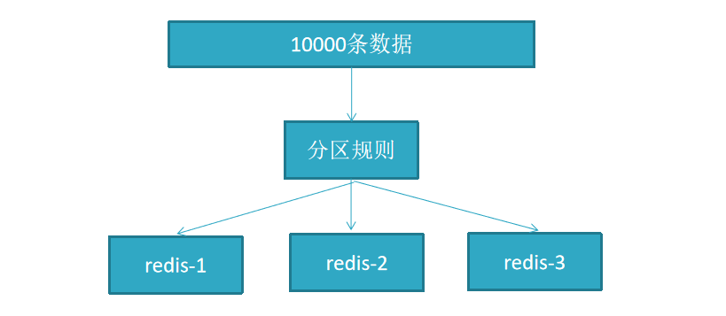
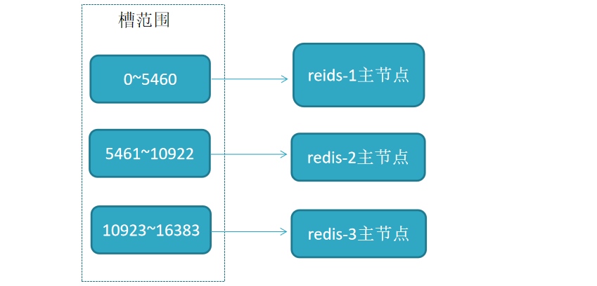
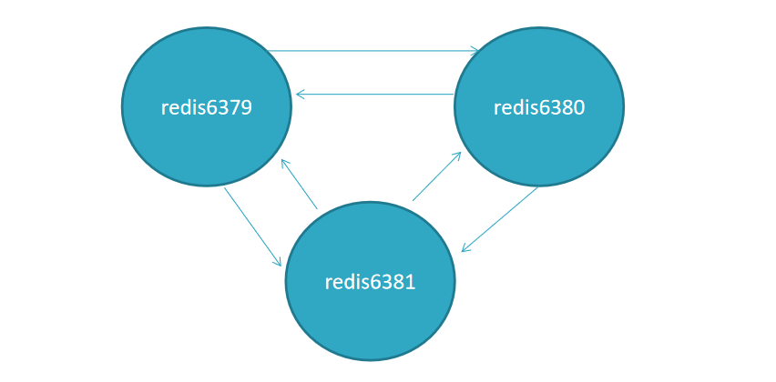
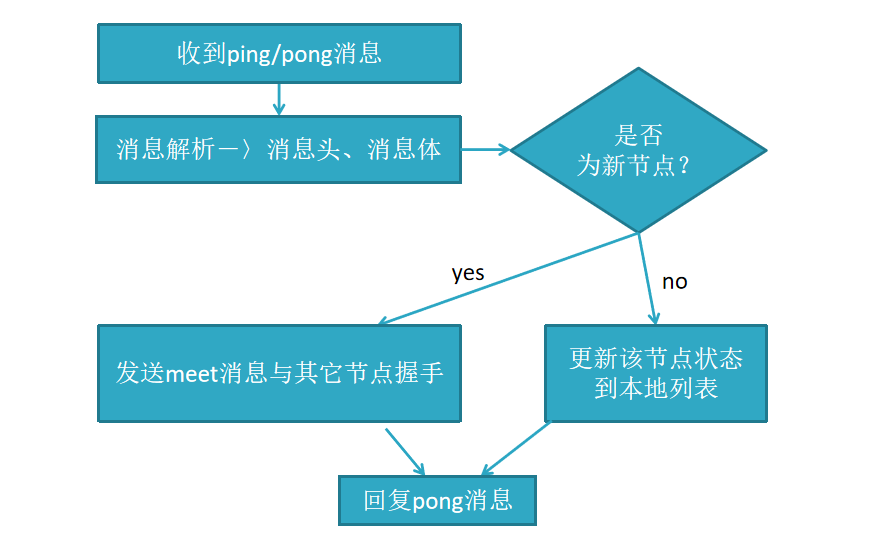
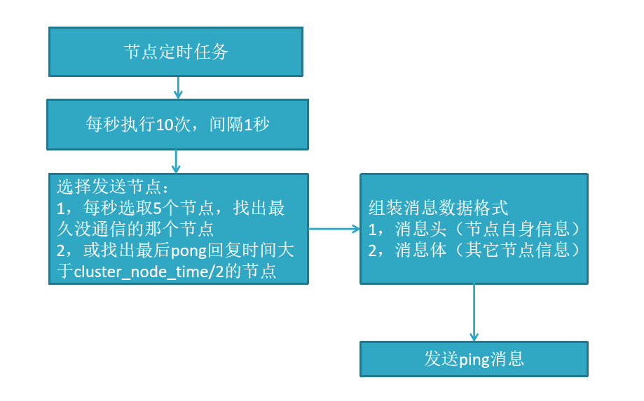

## 集群

sentinel模式基本可以满足一般生产的需求，具备高可用性。但是当数据量过大到一台服务器存放不下的情况时，主从模式或sentinel模式就不能满足需求了，这个时候需要对存储的数据进行分片，将数据存储到多个Redis实例中。cluster模式的出现就是为了解决单机Redis容量有限的问题，将Redis的数据根据一定的规则分配到多台机器


假设10000条数据，按分区规则分成3份，分别存入到3个redis节点




## 规则

RedisCluster采用“虚拟槽分区”

所有的键根据哈希函数(CRC16[key]%16383)映射到0－16383槽内，共16384个槽位

每个节点维护部分槽及槽所映射的键值数据




## 特点

```tex
多个redis节点网络互联，数据共享

所有的节点都是一主一从（也可以是一主多从），其中从不提供服务，仅作为备用

不支持同时处理多个key（如MSET/MGET），因为redis需要把key均匀分布在各个节点上，并发量很高的情况下同时创建key-value会降低性能并导致不可预测的行为
  
支持在线增加、删除节点

客户端可以连接任何一个主节点进行读写
```


## 节点通信原理

Redis集群采用P2P的Gossip（流言）协议，Gossip协议工作原理就是节点彼此不断通信交换信息，一段时间后所有的节点都会知道集群完整的信息，这种方式类似流言传播




```
集群中的每个节点都会单独开辟一个TCP通道，用于节点之间彼此通信，通信端口号在基础端口上加10000

每个节点在固定周期内通过特定规则选择几个节点发送ping消息

接收到ping消息的节点用pong消息作为响应

集群中每个节点通过一定规则挑选要通信的节点，每个节点可能知道全部节点，也可能仅知道部分节点，只要这些节点彼此可以正常通信，最终它们会达到一致的状态。

当节点出故障、新节点加入、主从角色变化、槽信息变更等事件发生时，通过不断的ping/pong消息通信，经过一段时间后所有的节点都会知道整个集群全部节点的最新状态，从而达到集群状态同步的目的。
```

## Gossip消息

```
Gossip协议的主要职责就是信息交换。信息交换的载体就是节点彼此发送的Gossip消息

常用的Gossip消息可分为：ping消息、pong消息、meet消息、fail消息

meet消息：用于通知新节点加入。消息发送者通知接收者加入到当前集群，meet消息通信正常完成后，接收节点会加入到集群中并进行周期性的ping、pong消息交换

ping消息：集群内交换最频繁的消息，集群内每个节点每秒向多个其他节点发送ping消息，用于检测节点是否在线和交换彼此状态信息。ping消息发送封装了自身节点和部分其他节点的状态数据

pong消息：当接收到ping、meet消息时，作为响应消息回复给发送方确认消息正常通信。pong消息内部封装了自身状态数据。节点也可以向集群内广播自身的pong消息来通知整个集群对自身状态进行更新

fail消息：当节点判定集群内另一个节点下线时，会向集群内广播一个fail消息，其他节点接收到fail消息之后把对应节点更新为下线状态
```

```
解析消息头：消息头包含了发送节点的信息，如果发送节点是新节点且消息是meet类型，则加入到本地节点列表；如果是已知节点，则尝试更新发送节点的状态，如槽映射关系、主从角色等状态

解析消息体：如果消息体的clusterMsgDataGossip数组包含的节点是新节点，则尝试发起与新节点的meet握手流程；如果是已知节点，则根据clusterMsgDataGossip中的flags字段判断该节点是否下线，用于故障转移
```



## 节点选择




```
内部频繁地进行节点信息交换，ping/pong消息会携带当前节点和部分其他节点的状态数据，会加重带宽和计算的负担

Redis集群内节点通信采用固定频率（定时任务每秒执行10次）。因此节点每次选择需要通信的节点列表变得非常重要

通信节点选择过多虽然可以做到信息及时交换但成本过高

节点选择过少会降低集群内所有节点彼此信息交换频率，从而影响故障判定、新节点发现等需求的速度

因此Redis集群的Gossip协议需要兼顾信息交换实时性和成本开销
```


```
选择发送消息的节点数量

集群内每个节点维护定时任务默认每秒执行10次，每秒会随机选取5个节点找出最久没有通信的节点发送ping消息，用于保证Gossip信息交换的随机性。

每100毫秒都会扫描本地节点列表，如果发现节点最近一次接受pong消息的时间大于cluster_node_timeout/2，则立刻发送ping消息，防止该节点信息太长时间未更新。

每个节点每秒需要发送ping消息的数量=1+10*num（node.pong_received>cluster_node_timeout/2）
因此cluster_node_timeout参数对消息发送的节点数量影响非常大。

当我们的带宽资源紧张时，可以适当调大这个参数，如从默认15秒改为30秒来降低带宽占用率。
过度调大cluster_node_timeout会影响消息交换的频率从而影响故障转移、槽信息更新、新节点发现的速度。
需要根据业务容忍度和资源消耗进行平衡。同时整个集群消息总交换量也跟节点数成正比。
```

```
消息数据量

每个ping消息的数据量体现在消息头和消息体中，其中消息头主要占用空间的字段是myslots[CLUSTER_SLOTS/8]，占用2KB，这块空间占用相对固定。消息体会携带一定数量的其他节点信息用于信息交换，消息体携带数据量跟集群的节点数息息相关，更大的集群每次消息通信的成本也就更高
```


## 搭建

安装好单机版redis

redis集群需要至少要三个master节点，并且给每个master再搭建一个slave节点，

总共6个redis节点

这里用一台机器（可以多台机器部署，修改一下ip地址就可以了）部署6个redis实例，三主三从

在/usr/local下创建文件夹redis-cluster

然后在其下面创建6个文件夾

```
cd /usr/local

mkdir redis-cluster

cd redis-cluster

mkdir 7001 7002 7003 7004 7005 7006
```


把单机redis.conf配置文件copy到7001-7006下

```
cp /usr/local/redis-cluster/bin/redis.conf /usr/local/redis-cluster/7001/
cp /usr/local/redis-cluster/bin/redis.conf /usr/local/redis-cluster/7002/
cp /usr/local/redis-cluster/bin/redis.conf /usr/local/redis-cluster/7003/
cp /usr/local/redis-cluster/bin/redis.conf /usr/local/redis-cluster/7004/
cp /usr/local/redis-cluster/bin/redis.conf /usr/local/redis-cluster/7005/
cp /usr/local/redis-cluster/bin/redis.conf /usr/local/redis-cluster/7006/
```


修改如下内容：

```
vim /usr/local/redis-cluster/7001/redis.conf
```


显示行号

:set number

	69 		#bind 127.0.0.1 		注释
	88 		protected-mode no 		关闭保护模式
	92 		port 7001
	136 	daemonize yes
	263 	dir /usr/local/redis-cluster/7001
	699 	appendonly yes
	838 	cluster-enabled yes 	去掉注释
	846 	cluster-config-file nodes-7001.conf //原值 nodes-6379.conf
	852 	cluster-node-timeout 15000

把修改后的配置文件，copy到7002-7006目录下

```
cd /usr/local/redis-cluster

cp 7001/redis.conf 7002/
cp 7001/redis.conf 7003/
cp 7001/redis.conf 7004/
cp 7001/redis.conf 7005/
cp 7001/redis.conf 7006/
```


修改端口号

```
cd /usr/local/redis-cluster
```


批量替换

```
vim 7002/redis.conf
:%s/7001/7002/g 		##提示替换3项
:wq						##保存退出

vim 7003/redis.conf
:%s/7001/7003/g 		##提示替换3项
:wq						##保存退出

...7006
```


继续修改 7002-7006/redis.conf

启动6个redis实例

```
/usr/local/redis-cluster/bin/redis-server /usr/local/redis-cluster/7001/redis.conf
/usr/local/redis-cluster/bin/redis-server /usr/local/redis-cluster/7002/redis.conf
/usr/local/redis-cluster/bin/redis-server /usr/local/redis-cluster/7003/redis.conf
/usr/local/redis-cluster/bin/redis-server /usr/local/redis-cluster/7004/redis.conf
/usr/local/redis-cluster/bin/redis-server /usr/local/redis-cluster/7005/redis.conf
/usr/local/redis-cluster/bin/redis-server /usr/local/redis-cluster/7006/redis.conf
```


查看是否启动成功

```
ps -ef | grep redis 
```


用redis-cli创建redis集群  

redis5以前的版本集群依赖ruby脚本 redis-trib.rb

redis5以后的集群由c语言开发,

--cluster-replicas n   一主N从

```
/usr/local/redis-cluster/bin/redis-cli --cluster create --cluster-replicas 1 192.168.5.4:7001 192.168.5.4:7002 192.168.5.4:7003 192.168.5.4:7004 192.168.5.4:7005 192.168.5.4:7006
```


忽略警告 根据提示输入 yes

客户端连接测试

```
/usr/local/redis-cluster/bin/redis-cli -c -h 你的ip -p 7001
```

```
cluster info
cluster nodes
```


关闭集群需要逐个进行关闭

```
/usr/local/redis-cluster/bin/redis-cli -c -h 你的ip -p 7001 shutdown
/usr/local/redis-cluster/bin/redis-cli -c -h 你的ip -p 7002 shutdown
/usr/local/redis-cluster/bin/redis-cli -c -h 你的ip -p 7003 shutdown
/usr/local/redis-cluster/bin/redis-cli -c -h 192.168.229.151 -p 7004 shutdown
/usr/local/redis-cluster/bin/redis-cli -c -h 192.168.229.151 -p 7005 shutdown
/usr/local/redis-cluster/bin/redis-cli -c -h 192.168.229.151 -p 7006 shutdown
```


参考文章

Gossip

https://blog.csdn.net/Jin_Kwok/article/details/90111631

