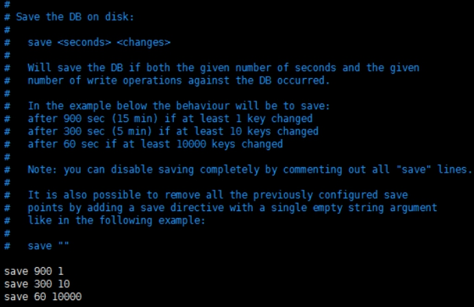
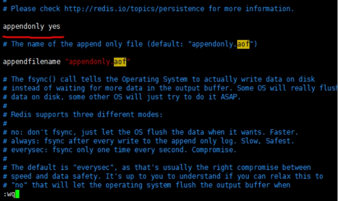

 

# 1. redis的介绍 

## 1.1. 什么是NoSql

为了解决高并发、高可扩展（集群）、高可用（不能宕机）、大数据存储问题而产生的数据库解决方案，就是NoSql数据库。

NoSql  ：全称 not only sql ,非关系型数据库。可以作为关系型数据库的一个很好的补充。不能替代。

## 1.2. NoSql数据库分类

键值(Key-Value)存储数据库

​	相关产品： Tokyo Cabinet/Tyrant、**Redis**、Voldemort、Berkeley DB。

​	典型应用：内容缓存，主要用于处理大量数据的高访问负载。

​	数据模型：一系列键值对

​	优势：快速查询

​	劣势：存储的数据缺少结构化

 

列存储数据库

​	相关产品：Cassandra, **HBase**, Riak

​	典型应用：分布式的文件系统

​	数据模型：以列簇式存储，将同一列数据存在一起

​	优势：查找速度快，可扩展性强，更容易进行分布式扩展

​	劣势：功能相对局限

 

文档型数据库

​	相关产品：CouchDB、**MongoDB**

​	典型应用：Web应用（与Key-Value类似，Value是结构化的）

​	数据模型：一系列键值对

​	优势：数据结构要求不严格

​	劣势：查询性能不高，而且缺乏统一的查询语法

 

 图形(Graph)数据库

​	相关数据库：Neo4J、InfoGrid、Infinite Graph

​	典型应用：社交网络

​	数据模型：图结构

​	优势：利用图结构相关算法。

​	劣势：需要对整个图做计算才能得出结果，不容易做分布式的集群方案。

 

## 1.3. 什么是redis

Redis是用C语言开发的一个开源的高性能键值对（**key-value**）数据库（nosql），应用在缓存。它通过提供多种键值数据类型来适应不同场景下的存储需求，目前为止Redis支持的键值数据类型有5种。

如下：

字符串类型 (String) 

散列类型（hash）

列表类型(List)

集合类型(set)

有序集合类型(SortedSet)

## 1.4. redis的应用场景

 

缓存。

分布式集群架构中的session分离。

任务队列。（秒杀、抢购、12306等等）

应用排行榜。（SortedSet）

网站访问统计。

数据过期处理。(expire)

 

# 2. Redis的安装 

## 2.1. redis的下载

官网地址：http://redis.io/

## 2.2. Redis的安装

Xftp 上传 redis 的源码包 redis-5.0.5.tar.gz

#### 编译环境(已安装,可略过)
```
yum install -y gcc-c++
```


#### 解压
```
tar -zxvf redis-5.0.4.tar.gz

cd redis-5.0.4/src
```


#### 指定安装目录
```
make install PREFIX=/usr/local/redis

cd ..

cp redis.conf  /usr/local/redis/bin

cd /usr/local/redis/bin

vim redis.conf
```


	输入 :set number 显示行号
	
	69行 bind 127.0.0.1 	#注释掉
	
	88行 protected-mode no 	#原值 yes
	
	136行 daemonize yes 	#原值 no
	
	:wq


#### 启动	
```
./redis-server redis.conf
```


#### 查看进程
```
ps -aux | grep redis
```


#### 关闭
```
./redis-cli shutdown
```


## 2.3. 连接redis

#### 本机客户端访问

```
./redis-cli
```

```
redis> set key1 value1
OK

redis> get key1
"value1"
```


#### 远程客户端访问

```
redis-cli -h ip地址 -p 6379
```

 

## 2.4. Redis五种数据类型

 

### 2.4.1. String : key-value	

```
redis命令不区分大小写，但是key区分的 

redis中的数据都是字符串。

redis是单线程，（不适合存储比较大的数据）
```

 

```


redis中所有的数据都是字符串。

set key value 设置值

get key 获取值

使用incr  命令，如果key 不存在，会自动创建key 并自动+1.
incr key 加一

decr key 减一
```

  

### 2.4.2. Hash: key-field-value


相当于一个key 对应一个map (map中又是key- value)

```
hset  key field value

hget  key field 

hincrby key field num   
```


### 2.4.3. List

List是有顺序可重复(数据结构中的：双链表，队列)

可作为链表 ，从左添加元素  也可以从右添加元素。

 

```
lpush list a b c d    (从左添加元素)

rpush list 1 2 3 4    (从右边添加元素)

lrange list 0 -1 (从0 到 -1 元素查看：也就表示查看所有)

lpop list （从左边取，删除）

rpop list  (从右边取，删除)
```

 

### 2.4.4. Set

Set无顺序，不能重复

```
sadd set1 a b c d d (向set1中添加元素) 元素不重复

smembers set1 （查询元素）

srem set1 a （删除元素）
```

 

### 2.4.5. SortedSet（zset）

```
有顺序，不能重复

适合做排行榜 排序需要一个分数属性 

zadd zset1 9 a 8 c 10 d 1 e   （添加元素 zadd key score member ）

(ZRANGE key start stop [WITHSCORES]) 	
(查看所有元素：zrange key  0  -1  withscores) 

如果要查看分数，加上withscores. 

zrange zset1 0 -1 (从小到大) 

zrevrange zset1 0 -1 (从大到小) 

zincrby zset2 score member (对元素member 增加 score)
```


## 2.5. key 命令

```
expire key second  (设置key的过期时间)

ttl key				查看剩余时间（-2 表示不存在，-1 表示已被持久化，正数表示剩余的时间）

persist key			清除过期时间，也即是持久化 持久化成功体提示 1 不成功0

del key 			删除key  

EXISTS key			若key存在，返回1，否则返回0。

select 0 			表示：选择0号数据库。默认是0号数据库, 默认16个库 编号0-15
```


# 3. Redis持久化方案 

​	

Redis 数据都放在内存中。如果机器挂掉，内存的数据就不存在。

需要做持久化，将内存中的数据保存在磁盘，下一次启动的时候就可以恢复数据到内存中。

1. RDB   快照形式  （定期将当前内存的数据保存磁盘中）会产生一个dump .rdb文件

​		特点：会存在数据丢失，性能较好，数据备份。

​	2. AOF   append only file  (所有对redis的操作命令记录在aof文件中)，恢复数据，重新执行一遍即可。

​		特点：每秒保存，数据比较完整，耗费性能。	

 

### 默认开启RDB 

如下图：redis.conf中默认设置了保存规则及时间间隔

 

 

### AOF开启设置

```
修改 redis.conf 文件  如下图：

将appendonly 设置为yes #699行
```

 

 

同时开启两个持久化方案，则按照 AOF的持久化放案恢复数据。 

默认是按照rdb的方式恢复数据，如果开启了AOF，就是用AOF恢复数据

数据是存在于/usr/local/redis/bin/appendonly . aof 文件中

# 4.Jedis

```xml
		<dependency>
            <groupId>redis.clients</groupId>
            <artifactId>jedis</artifactId>
            <version>3.2.0</version>
        </dependency>
```

```java
public class Main {
    public static void main(String[] args) throws Exception {
        Jedis jedis = new Jedis("192.168.5.55");
        String ping = jedis.ping();
        System.out.println("ping = " + ping);
        // set key1 value1
        jedis.set("mykey1", "myvalue1");
        System.out.println(jedis.get("mykey1"));
        // hset key field1 value1
        jedis.hset("mymap", "key1", "value1");
        System.out.println(jedis.hget("mymap", "key1"));
        // 过期时间
        jedis.expire("mykey1", 30);
        Thread.sleep(3000);
        Long ttl = jedis.ttl("mykey1");
        System.out.println("ttl = " + ttl);
    }
}
```


# 5. springboot整合redis

```xml
<dependency>
	<groupId>org.springframework.boot</groupId>
	<artifactId>spring-boot-starter-data-redis</artifactId>
</dependency>

<dependency>
	<groupId>org.apache.commons</groupId>
	<artifactId>commons-pool2</artifactId>
</dependency>

<dependency>
	<groupId>com.alibaba</groupId>
	<artifactId>fastjson</artifactId>
</dependency>
```

```properties
spring.redis.host=192.168.5.55
spring.redis.port=6379
```

```java
@SpringBootApplication
public class Main {
    public static void main(String[] args) {
        ConfigurableApplicationContext 
            applicationContext = SpringApplication.run(Main.class);
        StringRedisTemplate 
            stringRedisTemplate = applicationContext.getBean(StringRedisTemplate.class);
        // String
        stringRedisTemplate.opsForValue().set("springkey", "springvalue");
        System.out.println(stringRedisTemplate.opsForValue().get("springkey"));
        // Hash
        stringRedisTemplate.opsForHash().put("springhashkey", "key2", "value2");
        System.out.println(
            stringRedisTemplate.opsForHash().get("springhashkey", "key2"));
        // Object
        User user = new User();
        user.setUsername("aaa");
        user.setPassword("111");
        String json = JSONObject.toJSONString(user);
        stringRedisTemplate.opsForValue().set("userkey", json);
        String userJson = stringRedisTemplate.opsForValue().get("userkey");
        User user1 = JSONObject.parseObject(userJson, User.class);
        System.out.println("user1 = " + user1);
        //
        stringRedisTemplate.expire("userkey",10, TimeUnit.DAYS);
    }
}
```


# 基本命令参考

https://www.runoob.com/redis/redis-tutorial.html

# 缓存穿透 缓存雪崩

https://blog.csdn.net/kongtiao5/article/details/82771694

# 面试题参考

https://www.cnblogs.com/lfs2640666960/p/9700706.html