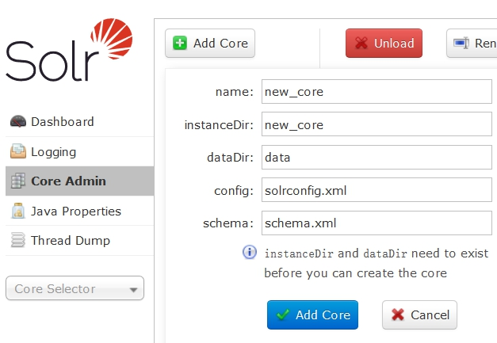
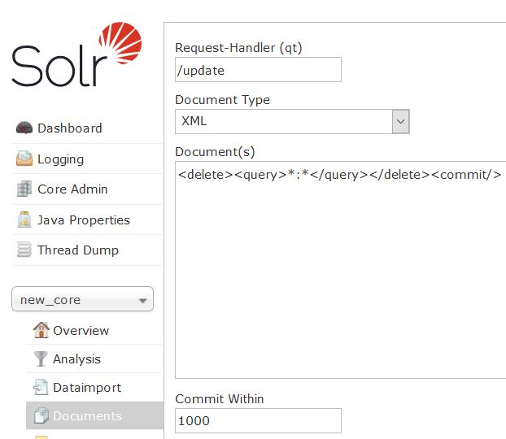

# 1.solr安装

```
yum install -y lsof

把solr的压缩包上传到Linux系统

tar  -zxvf  solr-7.7.2.tgz  -C  /usr/local

重命名 ==>  solr

#179行
将/usr/local/solr/bin/solr.in.sh文件中，SOLR_ULIMIT_CHECKS设置为false，消除启动时WARN

进入solr解压包的bin目录

./solr start  -force 	#root启动
./solr status			#查看状态
./solr stop  			#停止
```

 

## 创建core

```
在 /usr/local/solr/server/solr 下新建一目录 new_core
把 /usr/local/solr/server/solr/configsets/_default下的 conf 文件夹 复制到 new_core目录下

浏览器输入 http://ip:8983
```

 

 

 

 


## 编辑 managed-schema 文件

## 中文分词 (添加FieldType)


```xml
<!-- 配置中文分词器 -->
    <fieldType name="text_smartcn" class="solr.TextField" 
		positionIncrementGap="100">
        <analyzer type="index">
            <tokenizer 
			class="org.apache.lucene.analysis.cn.smart.HMMChineseTokenizerFactory"/>
        </analyzer>
        <analyzer type="query">
            <tokenizer 
			class="org.apache.lucene.analysis.cn.smart.HMMChineseTokenizerFactory"/>
        </analyzer>
    </fieldType>
```

 

## **配置业务域，type使用自定义的FieldType**

```xml
<!-- my_name 使用中文分词  -->
<field name="name" type="text_smartcn" indexed="true" stored="true"/>
<field name="price" type="plong" indexed="true" stored="true"/>
```

```xml
<!-- q=my_name:123 or my_price:123 -->
<!-- q= my_keywords:123 -->

<field      name="my_keywords" 
			type="text_smartcn" 
			indexed="true" 
			stored="false" 
			multiValued="true"/>
<copyField  source="name"        dest="my_keywords"/>
<copyField  source="price"       dest="my_keywords"/>
```


## **复制jar包**

找到

1.dist/solr-dataimporthandler-7.7.2.jar

2.dist/solr-dataimporthandler-extras-7.7.2.jar

3./usr/local/solr/contrib/analysis-extras/lucene-libs/lucene-analyzers-smartcn-7.7.2.jar

4.maven仓库下的mysql驱动包

复制到solr/server/solr-webapp/webapp/WEB-INF/lib下


## 删除数据

```xml
<delete><query>*:*</query></delete><commit/>
```




## 数据库导入(选学)

## 在new-core/conf  新建 db-data-config.xml(选学)

```xml
<?xml version="1.0" encoding="UTF-8" ?>
<dataConfig>
    <dataSource	name="abc" type="JdbcDataSource"
              	driver="com.mysql.cj.jdbc.Driver"
              	url="jdbc:mysql://10.10.9.18:3306/test?serverTimezone=GMT%2B8"
              	user="root"
              	password="1234" />
    <document>
        <entity	name="item" dataSource="abc"
				query="SELECT id,name,price FROM item">
            <!--对应managed-schema中的field-->
            <field column="id" name="id" />
			<field column="name" name="name" />
			<field column="price" name="price" />			
        </entity>
    </document>
</dataConfig>
```

 

 

## solrconfig.xml 添加 (688行左右)(选学)

 

```xml
<requestHandler  name="/dataimport" 	                                                                  class="org.apache.solr.handler.dataimport.DataImportHandler">
    <lst name="defaults">
		<!-- 文件名可以自定义 -->
      	<str name="config">db-data-config.xml</str>
    </lst>
</requestHandler>
```


## 注意: 虚拟机访问主机mysql

```sql
--给予任何IP访问权限
GRANT ALL PRIVILEGES ON *.* TO 'root'@'%' IDENTIFIED BY '1234' WITH GRANT OPTION;

--修改立即生效
FLUSH PRIVILEGES;
```


# 2.Springboot集成solr

 pom

```xml
<parent>
        <groupId>org.springframework.boot</groupId>
        <artifactId>spring-boot-starter-parent</artifactId>
        <version>2.1.9.RELEASE</version>
    </parent>

    <properties>
        <java.version>1.8</java.version>
    </properties>

    <dependencies>

        <dependency>
            <groupId>org.projectlombok</groupId>
            <artifactId>lombok</artifactId>
        </dependency>

        <dependency>
            <groupId>org.springframework.boot</groupId>
            <artifactId>spring-boot-starter-web</artifactId>
        </dependency>

        <dependency>
            <groupId>org.springframework.boot</groupId>
            <artifactId>spring-boot-starter-jdbc</artifactId>
        </dependency>

        <dependency>
            <groupId>org.mybatis.spring.boot</groupId>
            <artifactId>mybatis-spring-boot-starter</artifactId>
            <version>2.1.1</version>
        </dependency>

        <dependency>
            <groupId>tk.mybatis</groupId>
            <artifactId>mapper-spring-boot-starter</artifactId>
            <version>2.1.5</version>
        </dependency>

        <!-- Druid连接池 -->
        <dependency>
            <groupId>com.alibaba</groupId>
            <artifactId>druid-spring-boot-starter</artifactId>
            <version>1.1.21</version>
        </dependency>

        <dependency>
            <groupId>mysql</groupId>
            <artifactId>mysql-connector-java</artifactId>
        </dependency>

        <!-- solr -->
        <dependency>
            <groupId>org.springframework.boot</groupId>
            <artifactId>spring-boot-starter-data-solr</artifactId>
        </dependency>

    </dependencies>

    <build>
        <plugins>
            <plugin>
                <groupId>org.springframework.boot</groupId>
                <artifactId>spring-boot-maven-plugin</artifactId>
            </plugin>
        </plugins>
    </build>
```

application

```properties
server.port=8080
server.servlet.context-path=/demo
# 设置包的日志级别为debug
logging.level.org.springframework.web=debug
logging.level.demo=debug
#
spring.datasource.driver-class-name=com.mysql.cj.jdbc.Driver
spring.datasource.url=jdbc:mysql://localhost:3307/test?useSSL=false&serverTimezone=GMT%2B8&useUnicode=true&characterEncoding=utf8
spring.datasource.username=root
spring.datasource.password=1234
#
mybatis.mapper-locations=classpath:mappers/*.xml
# 静态资源的配置
spring.mvc.static-path-pattern=/static/**
spring.resources.static-locations=classpath:/static/
# solr
spring.data.solr.host=http://192.168.5.55:8983/solr/new_core
```

mapper

```java
@org.apache.ibatis.annotations.Mapper
public interface ItemMapper extends Mapper<Item> {
}
```

pojo

```java
@Data
public class Item {
    @Id
    @KeySql(useGeneratedKeys = true)
    private Integer id;
    private String name;
    private Long price;
}
```

service

```java
public interface SolrService {
    void indexAll() throws Exception;

    List<Item> search(String queryString, Integer page, Integer rows) throws Exception;
}


@Service("solrService")
public class SolrServiceImpl implements SolrService {

    @Autowired
    private SolrClient solrClient;

    @Autowired
    private ItemMapper itemMapper;

    @Override
    public void indexAll() throws Exception {
        List<Item> items = itemMapper.selectAll();
        for (Item item : items) {
            SolrInputDocument doc = new SolrInputDocument();
            doc.setField("id", item.getId());
            doc.setField("name", item.getName());
            doc.setField("price", item.getPrice());
            solrClient.add(doc);
        }
        solrClient.commit();
    }

    @Override
    public List<Item> search(String queryString, Integer page, Integer rows) 
        throws Exception {
        SolrQuery solrQuery = new SolrQuery();
        //查询关键字
        solrQuery.setQuery(queryString);
        //默认搜索域
        solrQuery.set("df", "my_keywords");
        //分页
        solrQuery.setStart((page - 1) * rows);
        solrQuery.setRows(rows);
        //高亮
        solrQuery.setHighlight(true);
        solrQuery.setHighlightSimplePre("<span style='color:red'>");
        solrQuery.setHighlightSimplePost("</span>");
        solrQuery.addHighlightField("name");
        //执行查询
        QueryResponse queryResponse = solrClient.query(solrQuery);
        //结果处理
        SolrDocumentList documentList = queryResponse.getResults();
        System.out.println("查询结果的总条数：" + documentList.getNumFound());
        Map<String, Map<String, List<String>>> 
            highlighting = queryResponse.getHighlighting();
        List<Item> items = new ArrayList<>();
        for (SolrDocument document : documentList) {
            Item item = new Item();
            Object id = document.getFieldValue("id");
            item.setId(Integer.parseInt(id.toString()));
            Object price = document.getFieldValue("price");
            item.setPrice((Long) price);
            List<String> strings = highlighting.get(id).get("name");
            if (strings != null && !strings.isEmpty()) {
                item.setName(strings.get(0));
            } else {
                item.setName(document.getFieldValue("name").toString());
            }
            items.add(item);
        }
        return items;
    }
}
```

controller

```java
@RestController
public class SolrController {

    @Autowired
    private SolrService solrService;

    @GetMapping("/index/all")
    public String indexAll() throws Exception {
        solrService.indexAll();
        return "index ok";
    }

    @GetMapping("/search")
    public List<Item> search() throws Exception {
        return solrService.search("海尔", 1, 10);
    }
}
```

main

```java
@SpringBootApplication
public class Main {
    public static void main(String[] args) {
        SpringApplication.run(Main.class);
    }
}
```

